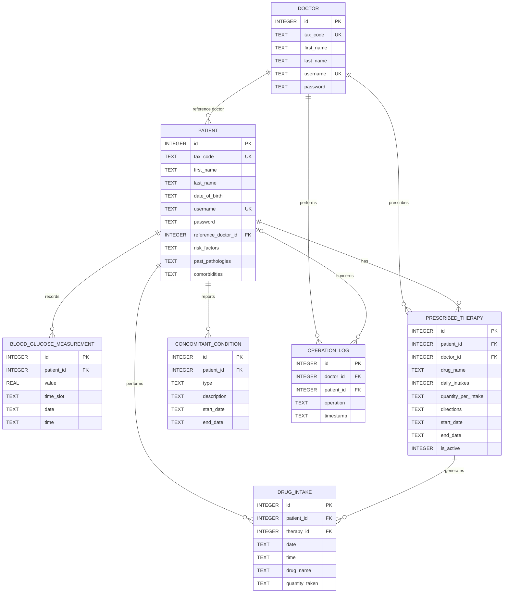
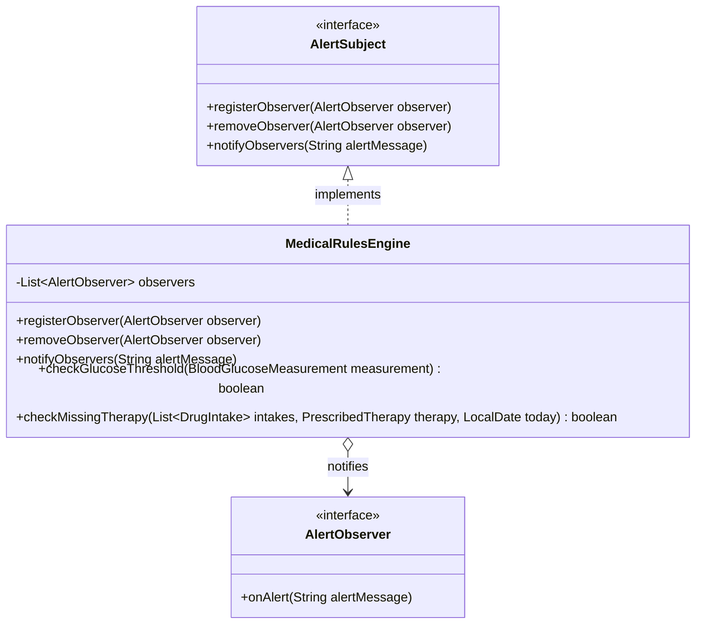
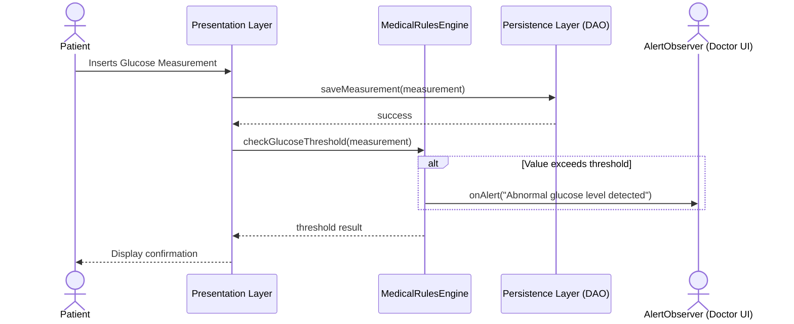

# Technical Database Documentation & Data Model

This documentation describes the data architecture, conceptual model, and SQLite database schema for the **Telemedicine System for Diabetic Patients**.

---

## 1. Conceptual Class Diagram

The conceptual class diagram models the application domain entities and their associations, independent of the persistence technology.

### Description of Conceptual Classes
- **Doctor**: Represents the authenticated diabetologist who monitors patients, configures therapies, and updates medical histories.
- **Patient**: Represents the monitored diabetic patient who registers daily blood glucose readings and drug intakes.
- **BloodGlucoseMeasurement**: Represents a single blood glucose reading recorded by a patient.
- **PrescribedTherapy**: Represents a drug prescription schema issued by a doctor for a specific patient.
- **DrugIntake**: Represents a patient's self-reported log indicating they took a dose of a prescribed drug.
- **ConcomitantCondition**: Represents symptoms, other concurrent pathologies, or other non-prescribed therapies followed by the patient.
- **OperationLog**: Audit log capturing sensitive actions performed by doctors on patient records (e.g. changing therapies, updating risk factors).

---

## 2. Entity-Relationship (ER) Schema

The ER Schema defines the logical relational database structure implemented within the SQLite database.

### Relational Rules and Referential Integrity Constraints
1. **Doctor - Patient (1:N)**: A patient is assigned to a reference doctor. If an administrator attempts to delete a doctor who is currently assigned to patients, the action is blocked (`ON DELETE RESTRICT`) to prevent orphan patients.
2. **Patient - BloodGlucoseMeasurement (1:N)**: Readings belong to a specific patient. If the patient record is deleted, all associated measurements are deleted recursively (`ON DELETE CASCADE`).
3. **Patient - PrescribedTherapy (1:N)** and **Doctor - PrescribedTherapy (1:N)**: A therapy belongs to a patient and is linked to the prescribing doctor. Deleting the patient removes the therapies (`ON DELETE CASCADE`). Deleting the doctor is blocked (`ON DELETE RESTRICT`) to preserve historical prescription records.
4. **PrescribedTherapy - DrugIntake (1:N)**: Each logged intake references the active prescription schema. If a therapy is deleted, its compliance data is cascaded (`ON DELETE CASCADE`).

---

## 3. Detailed Database Tables Description

All data types are mapped to SQLite native storage classes (`INTEGER`, `REAL`, `TEXT`). Dates and times are stored as `TEXT` in standard ISO-8601 formatting to allow correct sorting and range checks.

### Table: `doctor`
Stores credentials and demographic information of diabetologists.
* **id**: `INTEGER` (PRIMARY KEY, AUTOINCREMENT). Unique doctor identifier.
* **tax_code**: `TEXT` (UNIQUE, NOT NULL). Codice Fiscale / Tax code.
* **first_name**: `TEXT` (NOT NULL). First name.
* **last_name**: `TEXT` (NOT NULL). Last name.
* **username**: `TEXT` (UNIQUE, NOT NULL). Login credential.
* **password**: `TEXT` (NOT NULL). Encrypted login password.

### Table: `patient`
Stores patient profiles, demographics, and clinical history text blocks.
* **id**: `INTEGER` (PRIMARY KEY, AUTOINCREMENT). Unique patient identifier.
* **tax_code**: `TEXT` (UNIQUE, NOT NULL). Patient's Tax code.
* **first_name**: `TEXT` (NOT NULL). First name.
* **last_name**: `TEXT` (NOT NULL). Last name.
* **date_of_birth**: `TEXT` (NOT NULL). Date of birth formatted as `YYYY-MM-DD`.
* **username**: `TEXT` (UNIQUE, NOT NULL). Patient login credential.
* **password**: `TEXT` (NOT NULL). Login password.
* **reference_doctor_id**: `INTEGER` (NOT NULL, FOREIGN KEY). Link to the doctor in charge.
* **risk_factors**: `TEXT` (NULL). Text notes on risk factors (e.g. "smoker, obesity").
* **past_pathologies**: `TEXT` (NULL). Note details on historical conditions.
* **comorbidities**: `TEXT` (NULL). concurrent conditions (e.g. "hypertension").

### Table: `blood_glucose_measurement`
Stores patient blood glucose logs.
* **id**: `INTEGER` (PRIMARY KEY, AUTOINCREMENT). Log identifier.
* **patient_id**: `INTEGER` (NOT NULL, FOREIGN KEY). Reference to patient.
* **value**: `REAL` (NOT NULL). Glucose reading value (in mg/dL).
* **time_slot**: `TEXT` (NOT NULL). Categorization (must be `'BEFORE_MEAL'` or `'AFTER_MEAL'`).
* **date**: `TEXT` (NOT NULL). Date formatted as `YYYY-MM-DD`.
* **time**: `TEXT` (NOT NULL). Time formatted as `HH:MM`.

### Table: `prescribed_therapy`
Contains active and historical drug prescriptions.
* **id**: `INTEGER` (PRIMARY KEY, AUTOINCREMENT). Prescription identifier.
* **patient_id**: `INTEGER` (NOT NULL, FOREIGN KEY). Reference to patient.
* **doctor_id**: `INTEGER` (NOT NULL, FOREIGN KEY). Reference to doctor who prescribed it.
* **drug_name**: `TEXT` (NOT NULL). Name of drug (e.g. "Metformin", "Rapid Insulin").
* **daily_intakes**: `INTEGER` (NOT NULL). Posology frequency per day.
* **quantity_per_intake**: `TEXT` (NOT NULL). Dose description (e.g. "500mg", "1 pill").
* **directions**: `TEXT` (NULL). Notes (e.g., "after meals", "on empty stomach").
* **start_date**: `TEXT` (NOT NULL). Validity start date (`YYYY-MM-DD`).
* **end_date**: `TEXT` (NULL). Validity end date (`YYYY-MM-DD`). NULL if ongoing.
* **is_active**: `INTEGER` (NOT NULL, DEFAULT 1). Boolean flag (1 = Active, 0 = Stopped/Replaced).

### Table: `drug_intake`
Tracks actual compliance entries reported by patients.
* **id**: `INTEGER` (PRIMARY KEY, AUTOINCREMENT). Entry identifier.
* **patient_id**: `INTEGER` (NOT NULL, FOREIGN KEY). Reference to patient.
* **therapy_id**: `INTEGER` (NOT NULL, FOREIGN KEY). Reference to prescription.
* **date**: `TEXT` (NOT NULL). Log date (`YYYY-MM-DD`).
* **time**: `TEXT` (NOT NULL). Log time (`HH:MM`).
* **drug_name**: `TEXT` (NOT NULL). Logged drug name.
* **quantity_taken**: `TEXT` (NOT NULL). Logged dose.

### Table: `concomitant_condition`
Tracks user-reported symptoms, temporary illnesses, or concurrent therapies.
* **id**: `INTEGER` (PRIMARY KEY, AUTOINCREMENT). Condition identifier.
* **patient_id**: `INTEGER` (NOT NULL, FOREIGN KEY). Reference to patient.
* **type**: `TEXT` (NOT NULL). Category (`'SYMPTOM'`, `'PATHOLOGY'`, or `'CONCOMITANT_THERAPY'`).
* **description**: `TEXT` (NOT NULL). Free description (e.g. "nausea", "headache").
* **start_date**: `TEXT` (NOT NULL). Period start date (`YYYY-MM-DD`).
* **end_date**: `TEXT` (NULL). Period end date (`YYYY-MM-DD`). NULL if ongoing.

### Table: `operation_log`
Audit trail of diabetologist actions for system security.
* **id**: `INTEGER` (PRIMARY KEY, AUTOINCREMENT). Log identifier.
* **doctor_id**: `INTEGER` (NOT NULL, FOREIGN KEY). Reference to doctor.
* **patient_id**: `INTEGER` (NULL, FOREIGN KEY). Target patient or NULL if general. Nullified on patient delete (`ON DELETE SET NULL`).
* **operation**: `TEXT` (NOT NULL). Description of the action (e.g. "Modified therapy: Metformin", "Updated comorbidities").
* **timestamp**: `TEXT` (NOT NULL). Action timestamp (`YYYY-MM-DD HH:MM:SS`).

---

## 4. Software Class Diagram (Business Logic)

The following class diagram represents the design of the Domain and Business Logic layers of the application, incorporating the Observer Design Pattern for medical alerts.

## 5. Sequence Diagram

The following sequence diagram illustrates the flow when a patient inserts a new blood glucose reading and the rules engine evaluates it, eventually notifying the doctor.

## 6. Architecture and Design Patterns

### Layered Architecture

The application adopts a **Layered Architecture** strictly separating Presentation, Business Logic, and Persistence:
- **Presentation Layer (JavaFX)**: Only handles FXML views and controllers. It delegates all decision-making to the logic layer and formatting to domain objects.
- **Business Logic Layer (`it.univr.telemedicina.logic`)**: Centralizes the medical rules (`MedicalRulesEngine`). It does not contain GUI code or SQL queries.
- **Persistence Layer (`it.univr.telemedicina.persistence`)**: Manages SQLite connections and executes CRUD operations via DAOs.

### Design Patterns

1. **Observer Pattern**: Used to decouple the component that verifies medical rules (`MedicalRulesEngine` as the Subject) from the components that must react to abnormalities (e.g. Doctors' dashboards or push notification services as Observers). This ensures that adding a new type of notification mechanism doesn't require modifying the core logic.
2. **Data Access Object (DAO) Pattern**: Encapsulates all access to the SQLite database. The Logic layer depends on domain objects (like `Patient`) and interacts with DAOs, completely oblivious to the underlying SQL dialect.

