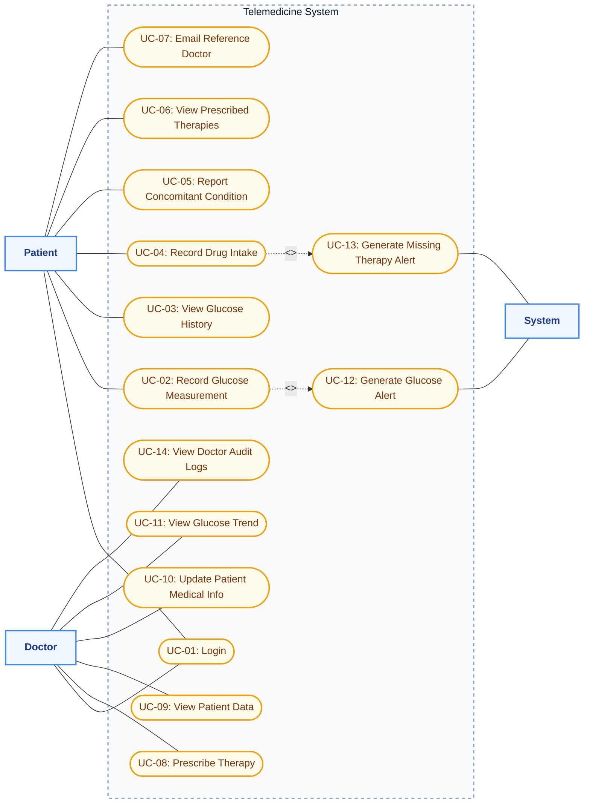
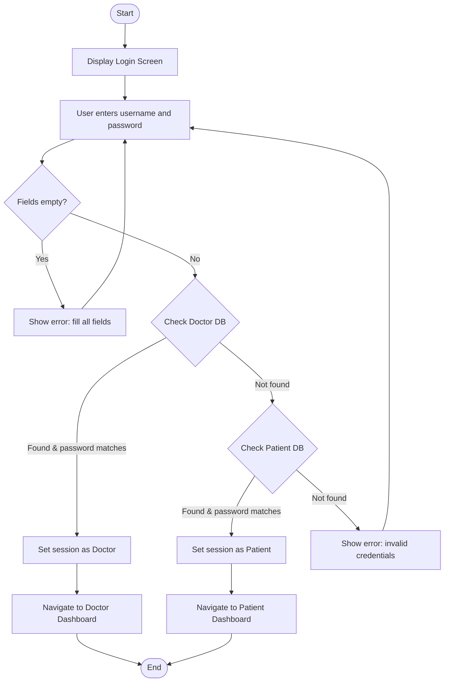
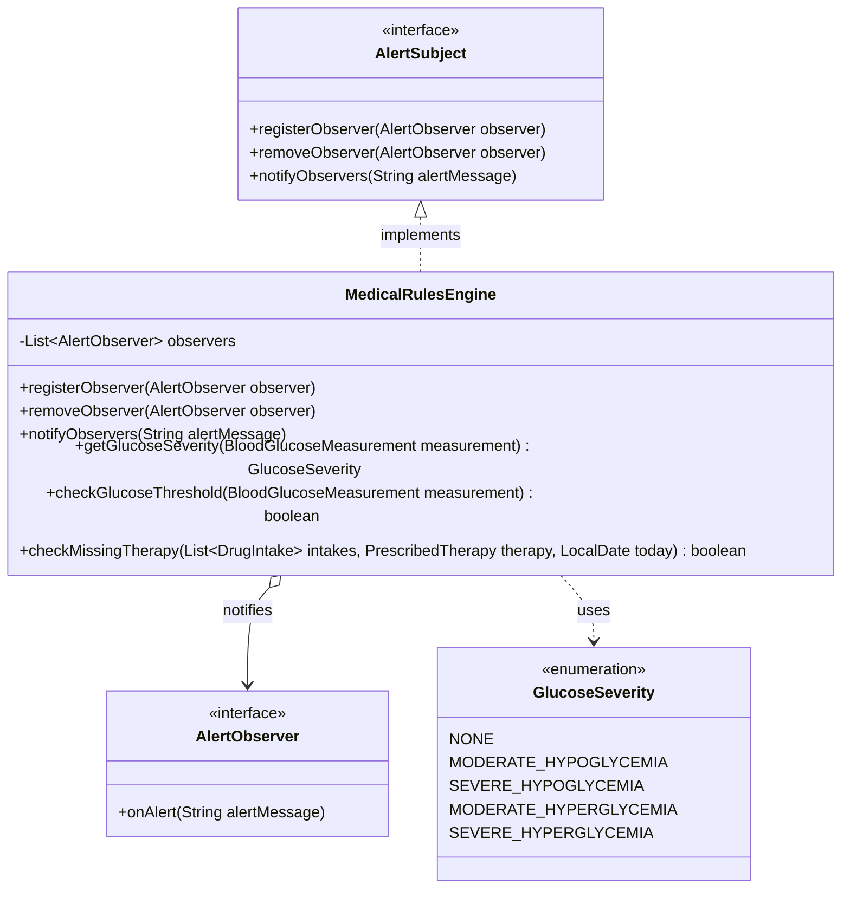
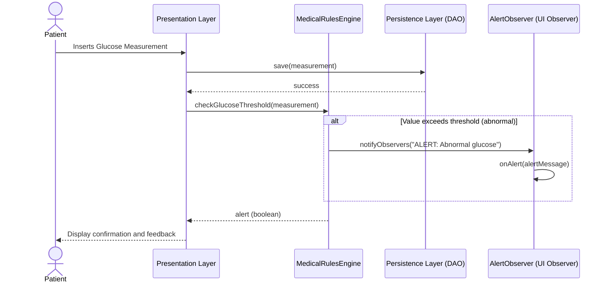
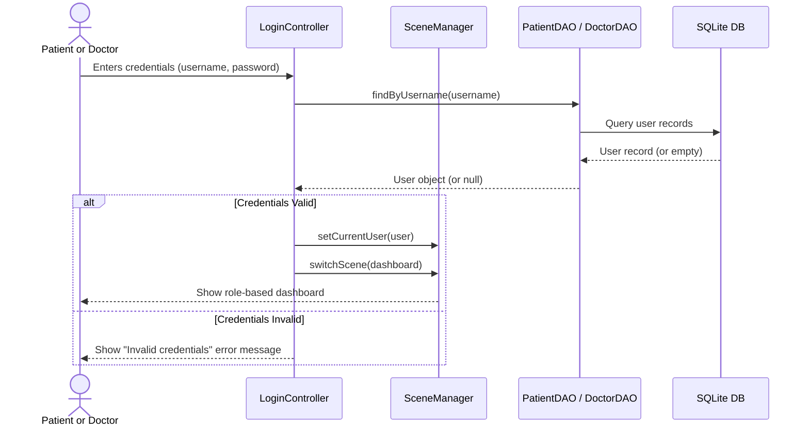
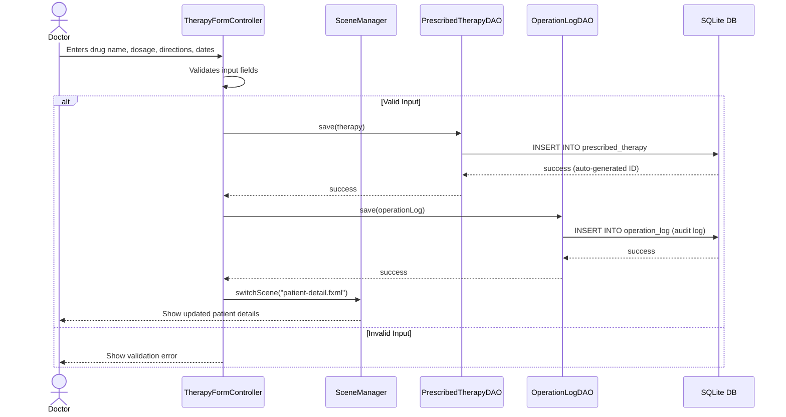
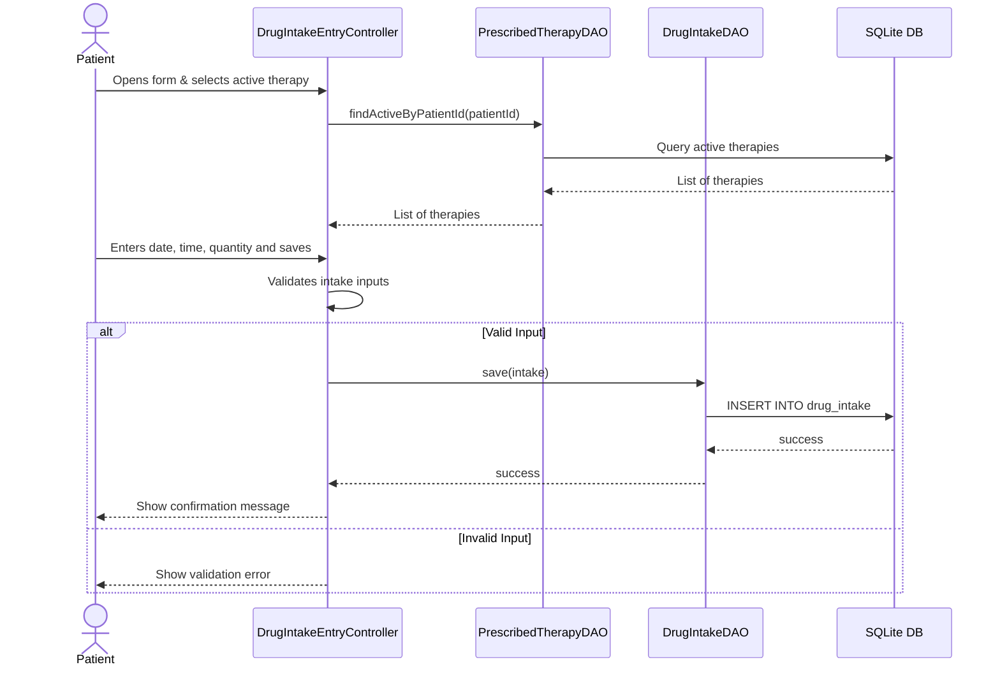
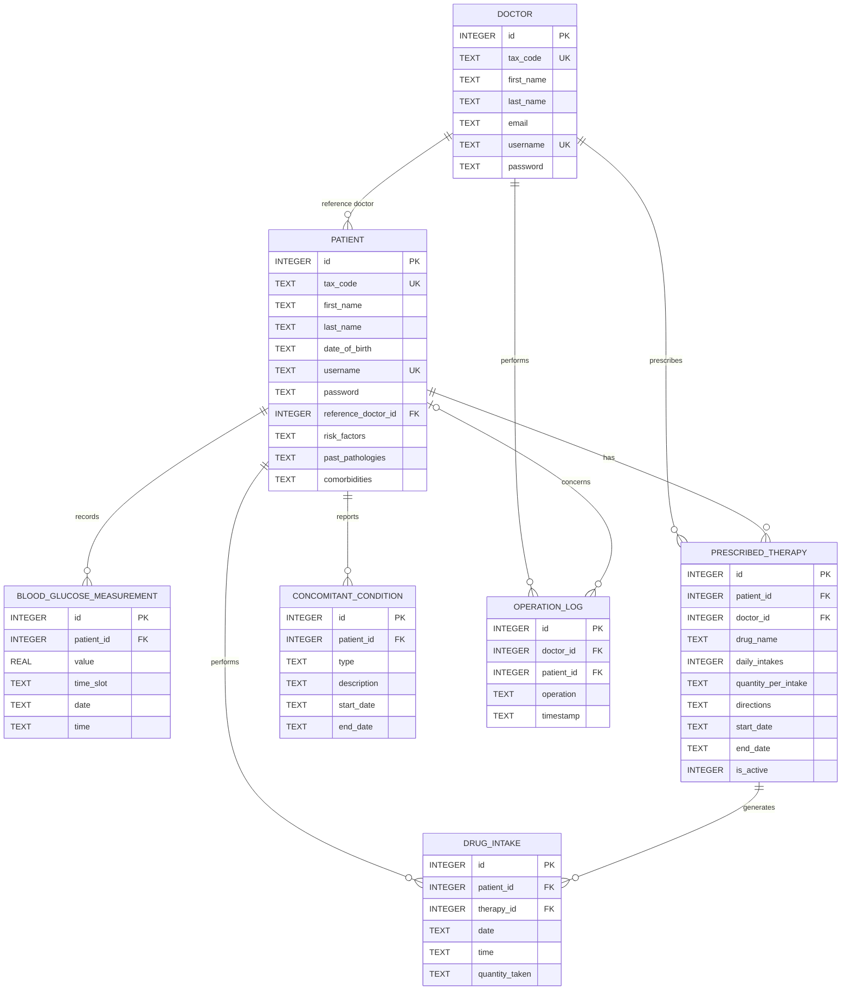

# Technical Documentation

This documentation describes the data architecture, conceptual model, and SQLite database schema for the **Telemedicine System for Diabetic Patients**.

---

## Table of Contents

1. [Requirements Analysis](#1-requirements-analysis)
2. [Use Case Diagram](#2-use-case-diagram)
3. [Use Case Specification Sheets](#3-use-case-specification-sheets)
4. [Conceptual Class Diagram](#4-conceptual-class-diagram)
5. [Activity Diagrams](#5-activity-diagrams)
6. [Architecture and Design Patterns](#6-architecture-and-design-patterns)
7. [Software Class Diagram (Business Logic)](#7-software-class-diagram-business-logic)
8. [Sequence Diagrams](#8-sequence-diagrams)
9. [Entity-Relationship (ER) Schema](#9-entity-relationship-er-schema)
10. [Detailed Database Tables Description](#10-detailed-database-tables-description)
11. [Detailed Description of Test Activities](#11-detailed-description-of-test-activities)

---

## 1. Requirements Analysis

### 1.1 Functional Requirements

| ID    | Requirement                                                                                                                                   | Actor           | Priority |
| ----- | --------------------------------------------------------------------------------------------------------------------------------------------- | --------------- | -------- |
| FR-01 | The system shall authenticate users (patients and doctors) via username and password.                                                         | Patient, Doctor | High     |
| FR-02 | Patients shall record daily blood glucose measurements, specifying value, time slot (before/after meal), date, and time.                      | Patient         | High     |
| FR-03 | The system shall alert patients when glucose levels exceed thresholds (>130 mg/dL before meal, >180 mg/dL after meal, <80 mg/dL before meal). | System          | High     |
| FR-04 | Patients shall record drug intakes linked to active prescribed therapies, specifying drug, quantity, date, and time.                          | Patient         | High     |
| FR-05 | Patients shall report concomitant conditions (symptoms, pathologies, concurrent therapies) with a description and time period.                | Patient         | Medium   |
| FR-06 | Doctors shall prescribe therapies specifying drug name, daily intakes, quantity per intake, directions, and dates.                            | Doctor          | High     |
| FR-07 | Doctors shall view patient data (glucose measurements, therapies, conditions) including synthetic summaries (weekly/monthly averages).        | Doctor          | High     |
| FR-08 | Doctors shall update patient medical information (risk factors, past pathologies, comorbidities), with audit logging.                         | Doctor          | Medium   |
| FR-09 | The system shall alert doctors when patients miss prescribed therapy intakes for 3+ consecutive days.                                         | System          | High     |
| FR-10 | Patients shall be able to email their reference doctor via system integration with the native mail client.                                    | Patient         | Low      |
| FR-11 | Doctors shall be able to view all audit logs of their own database operations.                                                                | Doctor          | Medium   |

---

## 2. Use Case Diagram

---

## 3. Use Case Specification Sheets

### UC-01: Login

| Field                | Description                                                                                                                                                                                             |
| -------------------- | ------------------------------------------------------------------------------------------------------------------------------------------------------------------------------------------------------- |
| **ID**               | UC-01                                                                                                                                                                                                   |
| **Name**             | Login                                                                                                                                                                                                   |
| **Actor(s)**         | Patient, Doctor                                                                                                                                                                                         |
| **Precondition**     | User has valid credentials created by the system administrator.                                                                                                                                         |
| **Main Flow**        | 1. User navigates to the login screen. 2. User enters username and password. 3. System verifies credentials against the database. 4. System redirects to the appropriate dashboard (patient or doctor). |
| **Alternative Flow** | 3a. Credentials are invalid → System displays an error message and remains on the login screen.                                                                                                         |
| **Postcondition**    | User is authenticated and has access to their role-specific dashboard.                                                                                                                                  |

### UC-02: Record Glucose Measurement

| Field                | Description                                                                                                                                                                                                                                                                                                                        |
| -------------------- | ---------------------------------------------------------------------------------------------------------------------------------------------------------------------------------------------------------------------------------------------------------------------------------------------------------------------------------- |
| **ID**               | UC-02                                                                                                                                                                                                                                                                                                                              |
| **Name**             | Record Glucose Measurement                                                                                                                                                                                                                                                                                                         |
| **Actor(s)**         | Patient                                                                                                                                                                                                                                                                                                                            |
| **Precondition**     | Patient is authenticated and on the glucose entry screen.                                                                                                                                                                                                                                                                          |
| **Main Flow**        | 1. Patient enters glucose value (mg/dL). 2. Patient selects time slot (before/after meal). 3. Patient selects date and enters time. 4. Patient clicks "Save". 5. System validates input. 6. System saves measurement to the database. 7. System checks glucose thresholds via MedicalRulesEngine. 8. System displays confirmation. |
| **Alternative Flow** | 5a. Input is invalid → error message shown. 7a. Value exceeds threshold → warning displayed to patient and alert sent to doctor.                                                                                                                                                                                                   |
| **Postcondition**    | Measurement is persisted. If abnormal, alert is generated.                                                                                                                                                                                                                                                                         |

### UC-03: View Glucose History

| Field             | Description                                                                                                                                                                                       |
| ----------------- | ------------------------------------------------------------------------------------------------------------------------------------------------------------------------------------------------- |
| **ID**            | UC-03                                                                                                                                                                                             |
| **Name**          | View Glucose History                                                                                                                                                                              |
| **Actor(s)**      | Patient                                                                                                                                                                                           |
| **Precondition**  | Patient is authenticated.                                                                                                                                                                         |
| **Main Flow**     | 1. Patient navigates to glucose history. 2. System loads all measurements. 3. Patient optionally filters by date range. 4. System displays measurements in a table with status (Normal/Abnormal). |
| **Postcondition** | Patient can see all past glucose readings with visual status indicators.                                                                                                                          |

### UC-04: Record Drug Intake

| Field                | Description                                                                                                                                                                                                                                                  |
| -------------------- | ------------------------------------------------------------------------------------------------------------------------------------------------------------------------------------------------------------------------------------------------------------ |
| **ID**               | UC-04                                                                                                                                                                                                                                                        |
| **Name**             | Record Drug Intake                                                                                                                                                                                                                                           |
| **Actor(s)**         | Patient                                                                                                                                                                                                                                                      |
| **Precondition**     | Patient is authenticated and has at least one active therapy prescribed.                                                                                                                                                                                     |
| **Main Flow**        | 1. Patient selects an active therapy from the dropdown. 2. System auto-fills drug name and suggested quantity. 3. Patient confirms/adjusts quantity, date, and time. 4. Patient clicks "Save". 5. System saves intake to the database linked to the therapy. |
| **Alternative Flow** | 1a. No active therapies → message shown that no therapies are prescribed.                                                                                                                                                                                    |
| **Postcondition**    | Drug intake is recorded and linked to the prescribed therapy for compliance tracking.                                                                                                                                                                        |

### UC-05: Report Concomitant Condition

| Field             | Description                                                                                                                                                                                                                    |
| ----------------- | ------------------------------------------------------------------------------------------------------------------------------------------------------------------------------------------------------------------------------ |
| **ID**            | UC-05                                                                                                                                                                                                                          |
| **Name**          | Report Concomitant Condition                                                                                                                                                                                                   |
| **Actor(s)**      | Patient                                                                                                                                                                                                                        |
| **Precondition**  | Patient is authenticated.                                                                                                                                                                                                      |
| **Main Flow**     | 1. Patient selects condition type (Symptom, Pathology, Concomitant Therapy). 2. Patient enters description. 3. Patient selects start date (and optional end date). 4. Patient clicks "Save". 5. System persists the condition. |
| **Postcondition** | Condition is saved and visible to the patient's doctor.                                                                                                                                                                        |

### UC-06: View Prescribed Therapies

| Field             | Description                                                                                                                                                                      |
| ----------------- | -------------------------------------------------------------------------------------------------------------------------------------------------------------------------------- |
| **ID**            | UC-06                                                                                                                                                                            |
| **Name**          | View Prescribed Therapies                                                                                                                                                        |
| **Actor(s)**      | Patient                                                                                                                                                                          |
| **Precondition**  | Patient is authenticated.                                                                                                                                                        |
| **Main Flow**     | 1. Patient navigates to therapies view. 2. System loads all therapies (active and stopped). 3. System displays them in a table with drug, dosage, directions, dates, and status. |
| **Postcondition** | Patient sees all current and past therapies.                                                                                                                                     |

### UC-07: Email Reference Doctor

| Field                | Description                                                                                                                                                                                 |
| -------------------- | ------------------------------------------------------------------------------------------------------------------------------------------------------------------------------------------- |
| **ID**               | UC-07                                                                                                                                                                                       |
| **Name**             | Email Reference Doctor                                                                                                                                                                      |
| **Actor(s)**         | Patient                                                                                                                                                                                     |
| **Precondition**     | Patient is authenticated and has an assigned reference doctor.                                                                                                                              |
| **Main Flow**        | 1. Patient clicks "Email Doctor" button. 2. System retrieves reference doctor's email. 3. System opens default mail client with pre-filled recipient and subject line via a `mailto:` link. |
| **Alternative Flow** | 2a. Doctor email is missing or not configured → System shows an error alert.                                                                                                                |
| **Postcondition**    | Mail composition window is opened targeted to the assigned doctor.                                                                                                                          |

### UC-08: Prescribe Therapy

| Field                | Description                                                                                                                                                                                                                                                                                                                   |
| -------------------- | ----------------------------------------------------------------------------------------------------------------------------------------------------------------------------------------------------------------------------------------------------------------------------------------------------------------------------- |
| **ID**               | UC-08                                                                                                                                                                                                                                                                                                                         |
| **Name**             | Prescribe Therapy                                                                                                                                                                                                                                                                                                             |
| **Actor(s)**         | Doctor                                                                                                                                                                                                                                                                                                                        |
| **Precondition**     | Doctor is authenticated.                                                                                                                                                                                                                                                                                                      |
| **Main Flow**        | 1. Doctor selects a patient from the dashboard. 2. Doctor clicks "Therapy" to open the prescription form. 3. Doctor enters drug name, daily intakes, quantity, directions, and start date. 4. Doctor clicks "Save Therapy". 5. System saves therapy to the database. 6. System creates an audit log entry in `operation_log`. |
| **Alternative Flow** | 4a. Required fields are missing → error shown.                                                                                                                                                                                                                                                                                |
| **Postcondition**    | New therapy is active and visible to the patient. Operation is logged.                                                                                                                                                                                                                                                        |

### UC-09: View Patient Data

| Field             | Description                                                                                                                                                                                                        |
| ----------------- | ------------------------------------------------------------------------------------------------------------------------------------------------------------------------------------------------------------------ |
| **ID**            | UC-09                                                                                                                                                                                                              |
| **Name**          | View Patient Data                                                                                                                                                                                                  |
| **Actor(s)**      | Doctor                                                                                                                                                                                                             |
| **Precondition**  | Doctor is authenticated.                                                                                                                                                                                           |
| **Main Flow**     | 1. Doctor views patient list on dashboard. 2. Doctor clicks "View" on a patient. 3. System loads patient info, glucose measurements, therapies, and conditions. 4. System displays all data in organized sections. |
| **Postcondition** | Doctor has complete visibility over the patient's medical data.                                                                                                                                                    |

### UC-10: Update Patient Medical Info

| Field             | Description                                                                                                                                                                                                                             |
| ----------------- | --------------------------------------------------------------------------------------------------------------------------------------------------------------------------------------------------------------------------------------- |
| **ID**            | UC-10                                                                                                                                                                                                                                   |
| **Name**          | Update Patient Medical Info                                                                                                                                                                                                             |
| **Actor(s)**      | Doctor                                                                                                                                                                                                                                  |
| **Precondition**  | Doctor is authenticated.                                                                                                                                                                                                                |
| **Main Flow**     | 1. Doctor clicks "Info" on a patient. 2. System loads current risk factors, pathologies, and comorbidities. 3. Doctor edits the fields. 4. Doctor clicks "Save Changes". 5. System updates the database and creates an audit log entry. |
| **Postcondition** | Patient info is updated. The operation is tracked with the doctor's identity in `operation_log`.                                                                                                                                        |

### UC-11: View Glucose Trend

| Field             | Description                                                                                                                                                                                                                                       |
| ----------------- | ------------------------------------------------------------------------------------------------------------------------------------------------------------------------------------------------------------------------------------------------- |
| **ID**            | UC-11                                                                                                                                                                                                                                             |
| **Name**          | View Glucose Trend (Synthetic Summary)                                                                                                                                                                                                            |
| **Actor(s)**      | Doctor                                                                                                                                                                                                                                            |
| **Precondition**  | Doctor is authenticated and viewing a patient's detail.                                                                                                                                                                                           |
| **Main Flow**     | 1. Doctor clicks "Glucose Chart". 2. Doctor selects period (weekly or monthly). 3. System computes average glucose values (before/after meal), total measurements, and abnormal count for each period. 4. System displays the summary in a table. |
| **Postcondition** | Doctor sees the glucose evolution over time in a synthetic format.                                                                                                                                                                                |

### UC-12: Generate Glucose Alert

| Field             | Description                                                                                                                                                                                                                                                                      |
| ----------------- | -------------------------------------------------------------------------------------------------------------------------------------------------------------------------------------------------------------------------------------------------------------------------------- |
| **ID**            | UC-12                                                                                                                                                                                                                                                                            |
| **Name**          | Generate Glucose Alert                                                                                                                                                                                                                                                           |
| **Actor(s)**      | System (Automatic)                                                                                                                                                                                                                                                               |
| **Precondition**  | A glucose measurement is logged or dashboard is loaded.                                                                                                                                                                                                                          |
| **Main Flow**     | 1. System invokes the `MedicalRulesEngine`. 2. System compares glucose values against thresholds (before meal 80-130 mg/dL, after meal <=180 mg/dL). 3. If values exceed thresholds, system classifies severity and displays alert badges on both patient and doctor dashboards. |
| **Postcondition** | Abnormal glucose alert is generated and displayed on dashboards.                                                                                                                                                                                                                 |

### UC-13: Generate Missed Therapy Alert

| Field             | Description                                                                                                                                                                                                                                                                 |
| ----------------- | --------------------------------------------------------------------------------------------------------------------------------------------------------------------------------------------------------------------------------------------------------------------------- |
| **ID**            | UC-13                                                                                                                                                                                                                                                                       |
| **Name**          | Generate Missed Therapy Alert                                                                                                                                                                                                                                               |
| **Actor(s)**      | System (Automatic)                                                                                                                                                                                                                                                          |
| **Precondition**  | Active therapies exist for the patient.                                                                                                                                                                                                                                     |
| **Main Flow**     | 1. System cross-checks drug intakes against prescribed therapies. 2. If daily intakes are incomplete, system displays a reminder for the patient. 3. If prescriptions are missed for consecutive days, system generates a missed adherence alert on the doctor's dashboard. |
| **Postcondition** | Adherence/missed therapy alerts are generated and displayed.                                                                                                                                                                                                                |

### UC-14: View Doctor Audit Logs

| Field             | Description                                                                                                                                                                                                                                                              |
| ----------------- | ------------------------------------------------------------------------------------------------------------------------------------------------------------------------------------------------------------------------------------------------------------------------ |
| **ID**            | UC-14                                                                                                                                                                                                                                                                    |
| **Name**          | View Doctor Audit Logs                                                                                                                                                                                                                                                   |
| **Actor(s)**      | Doctor                                                                                                                                                                                                                                                                   |
| **Precondition**  | Doctor is authenticated.                                                                                                                                                                                                                                                 |
| **Main Flow**     | 1. Doctor clicks "View Audit Logs" on dashboard. 2. System retrieves all logs from `operation_log` where `doctor_id` matches the current doctor. 3. System maps target patient IDs to full names. 4. System displays the logs in a table sorted by timestamp descending. |
| **Postcondition** | Doctor views a modal list of their performed medical database actions.                                                                                                                                                                                                   |

---

## 4. Conceptual Class Diagram

The conceptual class diagram models the application domain entities and their associations, independent of the persistence technology.

### Description of Conceptual Classes

- **Doctor**: Represents the authenticated diabetologist who monitors patients, configures therapies, and updates medical histories.
- **Patient**: Represents the monitored diabetic patient who registers daily blood glucose readings and drug intakes.
- **BloodGlucoseMeasurement**: Represents a single blood glucose reading recorded by a patient.
- **PrescribedTherapy**: Represents a drug prescription schema issued by a doctor for a specific patient.
- **DrugIntake**: Represents a patient's self-reported log indicating they took a dose of a prescribed drug.
- **ConcomitantCondition**: Represents symptoms, other concurrent pathologies, or other non-prescribed therapies followed by the patient.
- **OperationLog**: Audit log capturing sensitive actions performed by doctors on patient records (e.g. changing therapies, updating risk factors).

---

## 5. Activity Diagrams

### 5.1 Activity Diagram: Login and Authentication

### 5.2 Activity Diagram: Record Blood Glucose Measurement

### 5.3 Activity Diagram: Record Drug Intake

### 5.4 Activity Diagram: Prescribe Therapy

### 5.5 Activity Diagram: Missing Therapy Alert Generation

---

## 6. Architecture and Design Patterns

### Layered Architecture

The application adopts a **Layered Architecture** strictly separating Presentation, Business Logic, and Persistence:

- **Presentation Layer (JavaFX)**: Only handles FXML views and controllers. It delegates all decision-making to the logic layer and formatting to domain objects.
- **Business Logic Layer (`it.univr.telemedicina.logic`)**: Centralizes the medical rules (`MedicalRulesEngine`). It does not contain GUI code or SQL queries.
- **Persistence Layer (`it.univr.telemedicina.persistence`)**: Manages SQLite connections and executes CRUD operations via DAOs.

### Design Patterns

1. **Observer Pattern**: Used to decouple the component that verifies medical rules (`MedicalRulesEngine` as the Subject) from the components that must react to abnormalities (e.g. Doctors' dashboards or push notification services as Observers). This ensures that adding a new type of notification mechanism doesn't require modifying the core logic.
2. **Data Access Object (DAO) Pattern**: Encapsulates all access to the SQLite database. The Logic layer depends on domain objects (like `Patient`) and interacts with DAOs, completely oblivious to the underlying SQL dialect.

---

## 7. Software Class Diagram (Business Logic)

The following class diagram represents the design of the Domain and Business Logic layers of the application, incorporating the Observer Design Pattern for medical alerts.

---

## 8. Sequence Diagrams

The following sequence diagrams illustrate the detailed interaction flows for the primary use cases of the telemedicine system.

### 8.1 UC-02: Record Glucose Measurement

This diagram shows the flow when a patient records a new blood glucose reading. The presentation layer saves the measurement to the database and evaluates it via the rules engine, which notifies active observers if the value is abnormal.

### 8.2 UC-01: Login and Session Routing

This diagram shows the authentication flow when a user logs in. The system queries the corresponding database tables based on credentials to verify identity and redirect to the correct dashboard.

### 8.3 UC-08: Prescribe Therapy

This diagram shows the flow when a doctor prescribes a therapy. The therapy is saved as active, and the action is logged in the audit trail database table.

### 8.4 UC-04: Record Drug Intake

This diagram shows the flow when a patient reports a drug intake associated with a prescribed therapy.

---

## 9. Entity-Relationship (ER) Schema

The ER Schema defines the logical relational database structure implemented within the SQLite database.

### Relational Rules and Referential Integrity Constraints

1. **Doctor - Patient (1:N)**: A patient is assigned to a reference doctor. If an administrator attempts to delete a doctor who is currently assigned to patients, the action is blocked (`ON DELETE RESTRICT`) to prevent orphan patients.
2. **Patient - BloodGlucoseMeasurement (1:N)**: Readings belong to a specific patient. If the patient record is deleted, all associated measurements are deleted recursively (`ON DELETE CASCADE`).
3. **Patient - PrescribedTherapy (1:N)** and **Doctor - PrescribedTherapy (1:N)**: A therapy belongs to a patient and is linked to the prescribing doctor. Deleting the patient removes the therapies (`ON DELETE CASCADE`). Deleting the doctor is blocked (`ON DELETE RESTRICT`) to preserve historical prescription records.
4. **PrescribedTherapy - DrugIntake (1:N)**: Each logged intake references the active prescription schema. If a therapy is deleted, its compliance data is cascaded (`ON DELETE CASCADE`).

---

## 10. Detailed Database Tables Description

All data types are mapped to SQLite native storage classes (`INTEGER`, `REAL`, `TEXT`). Dates and times are stored as `TEXT` in standard ISO-8601 formatting to allow correct sorting and range checks.

### Table: `doctor`

Stores credentials and demographic information of diabetologists.

- **id**: `INTEGER` (PRIMARY KEY, AUTOINCREMENT). Unique doctor identifier.
- **tax_code**: `TEXT` (UNIQUE, NOT NULL). Codice Fiscale / Tax code.
- **first_name**: `TEXT` (NOT NULL). First name.
- **last_name**: `TEXT` (NOT NULL). Last name.
- **email**: `TEXT` (UNIQUE, NOT NULL). Doctor's email address.
- **username**: `TEXT` (UNIQUE, NOT NULL). Login credential.
- **password**: `TEXT` (NOT NULL). Encrypted login password.

### Table: `patient`

Stores patient profiles, demographics, and clinical history text blocks.

- **id**: `INTEGER` (PRIMARY KEY, AUTOINCREMENT). Unique patient identifier.
- **tax_code**: `TEXT` (UNIQUE, NOT NULL). Patient's Tax code.
- **first_name**: `TEXT` (NOT NULL). First name.
- **last_name**: `TEXT` (NOT NULL). Last name.
- **date_of_birth**: `TEXT` (NOT NULL). Date of birth formatted as `YYYY-MM-DD`.
- **username**: `TEXT` (UNIQUE, NOT NULL). Patient login credential.
- **password**: `TEXT` (NOT NULL). Login password.
- **reference_doctor_id**: `INTEGER` (NOT NULL, FOREIGN KEY). Link to the doctor in charge.
- **risk_factors**: `TEXT` (NULL). Text notes on risk factors (e.g. "smoker, obesity").
- **past_pathologies**: `TEXT` (NULL). Note details on historical conditions.
- **comorbidities**: `TEXT` (NULL). concurrent conditions (e.g. "hypertension").

### Table: `blood_glucose_measurement`

Stores patient blood glucose logs.

- **id**: `INTEGER` (PRIMARY KEY, AUTOINCREMENT). Log identifier.
- **patient_id**: `INTEGER` (NOT NULL, FOREIGN KEY). Reference to patient.
- **value**: `REAL` (NOT NULL). Glucose reading value (in mg/dL).
- **time_slot**: `TEXT` (NOT NULL). Categorization (must be `'BEFORE_MEAL'` or `'AFTER_MEAL'`).
- **date**: `TEXT` (NOT NULL). Date formatted as `YYYY-MM-DD`.
- **time**: `TEXT` (NOT NULL). Time formatted as `HH:MM`.

### Table: `prescribed_therapy`

Contains active and historical drug prescriptions.

- **id**: `INTEGER` (PRIMARY KEY, AUTOINCREMENT). Prescription identifier.
- **patient_id**: `INTEGER` (NOT NULL, FOREIGN KEY). Reference to patient.
- **doctor_id**: `INTEGER` (NOT NULL, FOREIGN KEY). Reference to doctor who prescribed it.
- **drug_name**: `TEXT` (NOT NULL). Name of drug (e.g. "Metformin", "Rapid Insulin").
- **daily_intakes**: `INTEGER` (NOT NULL). Posology frequency per day.
- **quantity_per_intake**: `TEXT` (NOT NULL). Dose description (e.g. "500mg", "1 pill").
- **directions**: `TEXT` (NULL). Notes (e.g., "after meals", "on empty stomach").
- **start_date**: `TEXT` (NOT NULL). Validity start date (`YYYY-MM-DD`).
- **end_date**: `TEXT` (NULL). Validity end date (`YYYY-MM-DD`). NULL if ongoing.
- **is_active**: `INTEGER` (NOT NULL, DEFAULT 1). Boolean flag (1 = Active, 0 = Stopped/Replaced).

### Table: `drug_intake`

Tracks actual compliance entries reported by patients.

- **id**: `INTEGER` (PRIMARY KEY, AUTOINCREMENT). Entry identifier.
- **patient_id**: `INTEGER` (NOT NULL, FOREIGN KEY). Reference to patient.
- **therapy_id**: `INTEGER` (NOT NULL, FOREIGN KEY). Reference to prescription (`prescribed_therapy`).
- **date**: `TEXT` (NOT NULL). Log date (`YYYY-MM-DD`).
- **time**: `TEXT` (NOT NULL). Log time (`HH:MM`).
- **quantity_taken**: `TEXT` (NOT NULL). Logged dose.

### Table: `concomitant_condition`

Tracks user-reported symptoms, temporary illnesses, or concurrent therapies.

- **id**: `INTEGER` (PRIMARY KEY, AUTOINCREMENT). Condition identifier.
- **patient_id**: `INTEGER` (NOT NULL, FOREIGN KEY). Reference to patient.
- **type**: `TEXT` (NOT NULL). Category (`'SYMPTOM'`, `'PATHOLOGY'`, or `'CONCOMITANT_THERAPY'`).
- **description**: `TEXT` (NOT NULL). Free description (e.g. "nausea", "headache").
- **start_date**: `TEXT` (NOT NULL). Period start date (`YYYY-MM-DD`).
- **end_date**: `TEXT` (NULL). Period end date (`YYYY-MM-DD`). NULL if ongoing.

### Table: `operation_log`

Audit trail of diabetologist actions for system security.

- **id**: `INTEGER` (PRIMARY KEY, AUTOINCREMENT). Log identifier.
- **doctor_id**: `INTEGER` (NOT NULL, FOREIGN KEY). Reference to doctor.
- **patient_id**: `INTEGER` (NULL, FOREIGN KEY). Target patient or NULL if general. Nullified on patient delete (`ON DELETE SET NULL`).
- **operation**: `TEXT` (NOT NULL). Description of the action (e.g. "Modified therapy: Metformin", "Updated comorbidities").
- **timestamp**: `TEXT` (NOT NULL). Action timestamp (`YYYY-MM-DD HH:MM:SS`).

---

## 11. Detailed Description of Test Activities

This section provides a detailed description of the verification activities carried out to ensure the correctness, robustness, and compliance of the telemedicine system. The testing strategy leverages JUnit 5 and is structured into three layers: Unit Tests, Data Consistency Tests, and System Tests.

### 11.1 Unit Tests (White-Box)

Unit tests verify individual business logic rules and methods in isolation. These are implemented in `MedicalRulesEngineTest.java` and focus on verifying the `MedicalRulesEngine` functionality.

- **Test Cases for Glycemic Thresholds:**
  - `testCheckGlucoseThreshold_NormalBeforeMeal`: Asserts that a blood glucose value of 100.0 mg/dL before meals is considered normal (returns `false` and triggers no observer alert notifications).
  - `testCheckGlucoseThreshold_HighBeforeMeal`: Asserts that a blood glucose value of 140.0 mg/dL before meals is detected as abnormal (returns `true` and triggers an observer alert notification).
  - `testCheckGlucoseThreshold_NormalAfterMeal`: Asserts that a blood glucose value of 150.0 mg/dL after meals is considered normal (returns `false` and triggers no observer alert notifications).
  - `testCheckGlucoseThreshold_HighAfterMeal`: Asserts that a blood glucose value of 190.0 mg/dL after meals is detected as abnormal (returns `true` and triggers an observer alert notification).
- **Test Cases for Therapy Adherence (Alert Rules):**
  - `testCheckMissingTherapy_NotMissing`: Verifies that if a patient reports intakes matching their prescribed frequency for the past 3 consecutive days, the rules engine does not raise an alert.
  - `testCheckMissingTherapy_MissingThreeDays`: Verifies that if no intakes are reported for the last 3 days for an active therapy, the engine correctly returns `true` and triggers a medical alert to notify the doctor.

### 11.2 Data Consistency Tests (Bioinformatics Constraint)

Data consistency tests are designed to validate database constraints, relational rules, referential integrity, and transaction correctness in the SQLite database. These are implemented in `DataConsistencyTest.java`.

- **Relational Integrity and Uniqueness Constraints:**
  - `testCreateAndRetrieveDoctorAndPatient`: Inserts doctor and patient records and asserts that auto-generated primary keys are created and attributes are successfully retrieved.
  - `testUniqueConstraints`: Asserts that saving two doctors with duplicate usernames or duplicate tax codes (Codice Fiscale) fails by raising a database `SQLException`.
  - `testForeignKeyDoctorDoesNotExist`: Validates referential integrity by asserting that trying to save a patient with a non-existent doctor ID throws a foreign key constraint violation.
- **Deletion Constraints and Cascades:**
  - `testDoctorDeletionRestricted`: Asserts that a doctor assigned to active patients cannot be deleted due to `ON DELETE RESTRICT` constraints, ensuring patients are never orphaned.
  - `testCascadingDeletePatient`: Verifies that deleting a patient recursively cascade-deletes all associated entities (`BLOOD_GLUCOSE_MEASUREMENT`, `PRESCRIBED_THERAPY`, `DRUG_INTAKE`, and `CONCOMITANT_CONDITION`) using SQLite's `ON DELETE CASCADE`.
  - `testLogOperazioneAndAudit`: Verifies that when a patient is deleted, their associated audit logs in the `operation_log` table persist, but the `patient_id` field is set to `NULL` (`ON DELETE SET NULL`), preserving the log details while removing the reference.
- **Query and CRUD correctness:**
  - `testBloodGlucoseDateFilters`: Asserts that range-based queries return only blood glucose measurements recorded within the requested start and end dates.
  - `testConcomitantConditionOperations`: Verifies basic CRUD operations (creation, query by type, update) for user-reported symptoms and pathologies.

### 11.3 System Tests (Black-Box / E2E Integration)

System tests simulate end-to-end integration workflows, verifying that all layers (presentation, logic, database) work seamlessly together to fulfill requirements. These are implemented in `SystemTest.java`.

- **Authentication & Access Control:**
  - `testLoginPatient` & `testLoginDoctor`: Verifies that valid patient and doctor credentials yield successful login operations.
  - `testLoginInvalidCredentials`: Verifies that login attempts with non-existent usernames or wrong passwords fail correctly.
- **Patient Workflows:**
  - `testPatientEnterGlucose`: Simulates a patient entering daily measurements and verifies that it is stored correctly in the database.
  - `testPatientGlucoseAlertGenerated`: Simulates a patient entering abnormal glucose values and verifies that it triggers warnings in the presentation layer and alert messages in the rules engine.
  - `testPatientRecordDrugIntake`: Simulates recording a medication intake matching a prescribed therapy.
  - `testPatientReportSymptom`: Verifies that user-reported symptoms and concurrent conditions are saved and categorized correctly.
- **Doctor Workflows:**
  - `testDoctorPrescribeTherapy`: Simulates a doctor prescribing a new therapy and verifies that the therapy is saved as active and the action is recorded in the audit trail (`operation_log`).
  - `testDoctorViewPatientData`: Simulates a doctor viewing a patient's detail view, ensuring all medical history, blood glucose trends, and therapies are visible.
  - `testDoctorUpdatePatientInfo`: Simulates a doctor updating risk factors, pathologies, and comorbidities, and checks that this information is successfully updated and audited.
- **System Alert Engine Integration:**
  - `testMissingTherapyAlertFlow`: Simulates checking therapy compliance for a patient who has not recorded intakes for the past 3 days and asserts that the rules engine raises an alert badge on the doctor's dashboard.
  - `testTherapyComplianceCheck`: Asserts that a compliant patient who registers medication intakes on time does not trigger any alert.
