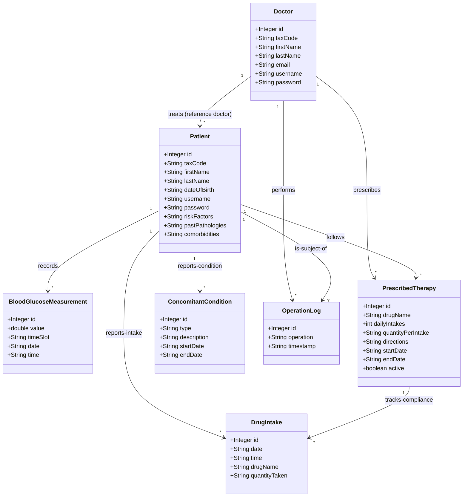
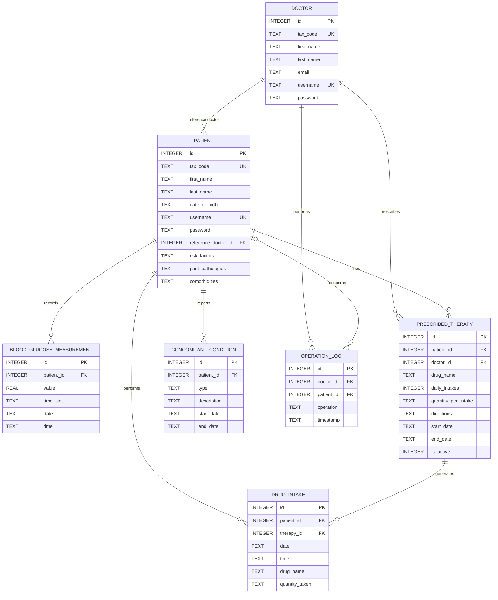
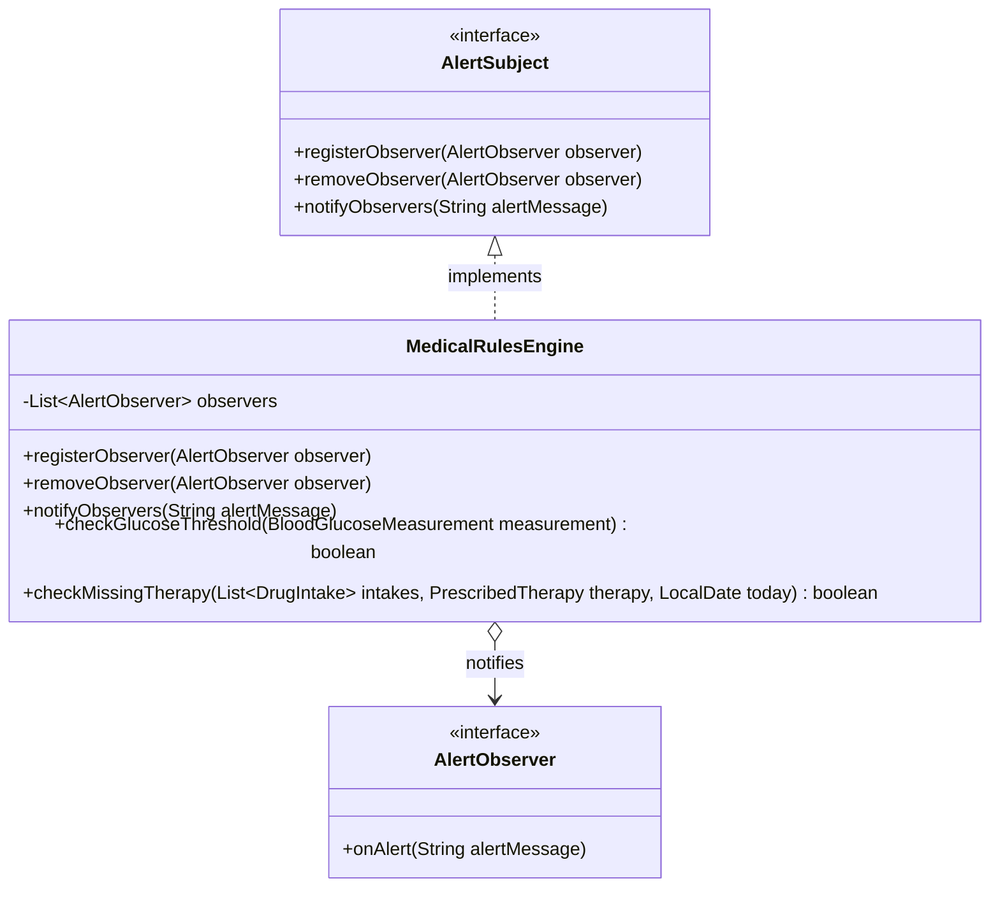
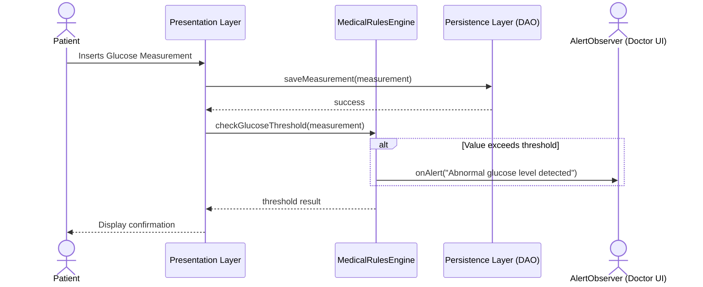
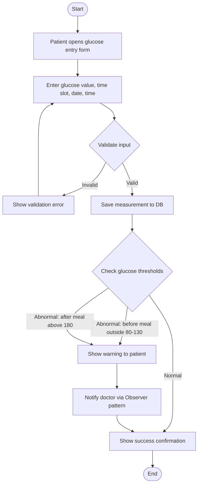
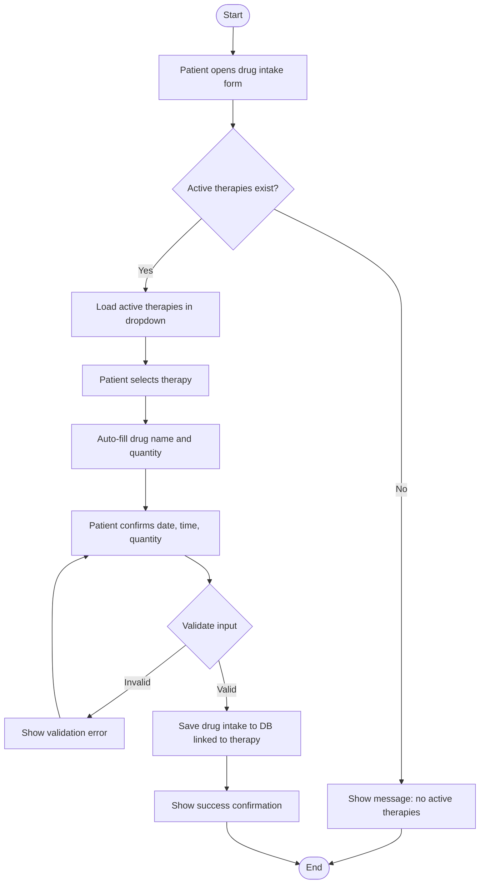
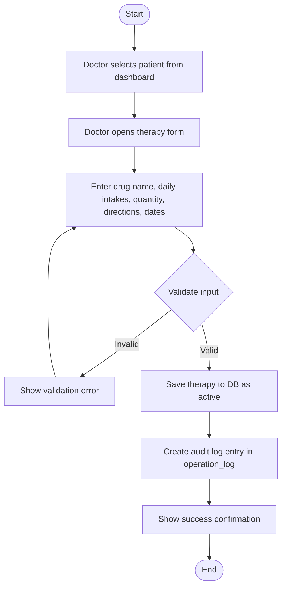
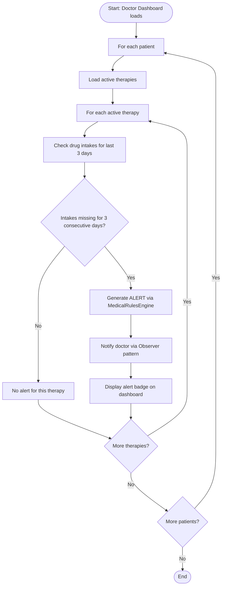

# Technical Database Documentation & Data Model

This documentation describes the data architecture, conceptual model, and SQLite database schema for the **Telemedicine System for Diabetic Patients**.

---

## 1. Conceptual Class Diagram

The conceptual class diagram models the application domain entities and their associations, independent of the persistence technology.

### Description of Conceptual Classes

- **Doctor**: Represents the authenticated diabetologist who monitors patients, configures therapies, and updates medical histories.
- **Patient**: Represents the monitored diabetic patient who registers daily blood glucose readings and drug intakes.
- **BloodGlucoseMeasurement**: Represents a single blood glucose reading recorded by a patient.
- **PrescribedTherapy**: Represents a drug prescription schema issued by a doctor for a specific patient.
- **DrugIntake**: Represents a patient's self-reported log indicating they took a dose of a prescribed drug.
- **ConcomitantCondition**: Represents symptoms, other concurrent pathologies, or other non-prescribed therapies followed by the patient.
- **OperationLog**: Audit log capturing sensitive actions performed by doctors on patient records (e.g. changing therapies, updating risk factors).

---

## 2. Entity-Relationship (ER) Schema

The ER Schema defines the logical relational database structure implemented within the SQLite database.

### Relational Rules and Referential Integrity Constraints

1. **Doctor - Patient (1:N)**: A patient is assigned to a reference doctor. If an administrator attempts to delete a doctor who is currently assigned to patients, the action is blocked (`ON DELETE RESTRICT`) to prevent orphan patients.
2. **Patient - BloodGlucoseMeasurement (1:N)**: Readings belong to a specific patient. If the patient record is deleted, all associated measurements are deleted recursively (`ON DELETE CASCADE`).
3. **Patient - PrescribedTherapy (1:N)** and **Doctor - PrescribedTherapy (1:N)**: A therapy belongs to a patient and is linked to the prescribing doctor. Deleting the patient removes the therapies (`ON DELETE CASCADE`). Deleting the doctor is blocked (`ON DELETE RESTRICT`) to preserve historical prescription records.
4. **PrescribedTherapy - DrugIntake (1:N)**: Each logged intake references the active prescription schema. If a therapy is deleted, its compliance data is cascaded (`ON DELETE CASCADE`).

---

## 3. Detailed Database Tables Description

All data types are mapped to SQLite native storage classes (`INTEGER`, `REAL`, `TEXT`). Dates and times are stored as `TEXT` in standard ISO-8601 formatting to allow correct sorting and range checks.

### Table: `doctor`

Stores credentials and demographic information of diabetologists.

- **id**: `INTEGER` (PRIMARY KEY, AUTOINCREMENT). Unique doctor identifier.
- **tax_code**: `TEXT` (UNIQUE, NOT NULL). Codice Fiscale / Tax code.
- **first_name**: `TEXT` (NOT NULL). First name.
- **last_name**: `TEXT` (NOT NULL). Last name.
- **email**: `TEXT` (UNIQUE, NOT NULL). Doctor's email address.
- **username**: `TEXT` (UNIQUE, NOT NULL). Login credential.
- **password**: `TEXT` (NOT NULL). Encrypted login password.

### Table: `patient`

Stores patient profiles, demographics, and clinical history text blocks.

- **id**: `INTEGER` (PRIMARY KEY, AUTOINCREMENT). Unique patient identifier.
- **tax_code**: `TEXT` (UNIQUE, NOT NULL). Patient's Tax code.
- **first_name**: `TEXT` (NOT NULL). First name.
- **last_name**: `TEXT` (NOT NULL). Last name.
- **date_of_birth**: `TEXT` (NOT NULL). Date of birth formatted as `YYYY-MM-DD`.
- **username**: `TEXT` (UNIQUE, NOT NULL). Patient login credential.
- **password**: `TEXT` (NOT NULL). Login password.
- **reference_doctor_id**: `INTEGER` (NOT NULL, FOREIGN KEY). Link to the doctor in charge.
- **risk_factors**: `TEXT` (NULL). Text notes on risk factors (e.g. "smoker, obesity").
- **past_pathologies**: `TEXT` (NULL). Note details on historical conditions.
- **comorbidities**: `TEXT` (NULL). concurrent conditions (e.g. "hypertension").

### Table: `blood_glucose_measurement`

Stores patient blood glucose logs.

- **id**: `INTEGER` (PRIMARY KEY, AUTOINCREMENT). Log identifier.
- **patient_id**: `INTEGER` (NOT NULL, FOREIGN KEY). Reference to patient.
- **value**: `REAL` (NOT NULL). Glucose reading value (in mg/dL).
- **time_slot**: `TEXT` (NOT NULL). Categorization (must be `'BEFORE_MEAL'` or `'AFTER_MEAL'`).
- **date**: `TEXT` (NOT NULL). Date formatted as `YYYY-MM-DD`.
- **time**: `TEXT` (NOT NULL). Time formatted as `HH:MM`.

### Table: `prescribed_therapy`

Contains active and historical drug prescriptions.

- **id**: `INTEGER` (PRIMARY KEY, AUTOINCREMENT). Prescription identifier.
- **patient_id**: `INTEGER` (NOT NULL, FOREIGN KEY). Reference to patient.
- **doctor_id**: `INTEGER` (NOT NULL, FOREIGN KEY). Reference to doctor who prescribed it.
- **drug_name**: `TEXT` (NOT NULL). Name of drug (e.g. "Metformin", "Rapid Insulin").
- **daily_intakes**: `INTEGER` (NOT NULL). Posology frequency per day.
- **quantity_per_intake**: `TEXT` (NOT NULL). Dose description (e.g. "500mg", "1 pill").
- **directions**: `TEXT` (NULL). Notes (e.g., "after meals", "on empty stomach").
- **start_date**: `TEXT` (NOT NULL). Validity start date (`YYYY-MM-DD`).
- **end_date**: `TEXT` (NULL). Validity end date (`YYYY-MM-DD`). NULL if ongoing.
- **is_active**: `INTEGER` (NOT NULL, DEFAULT 1). Boolean flag (1 = Active, 0 = Stopped/Replaced).

### Table: `drug_intake`

Tracks actual compliance entries reported by patients.

- **id**: `INTEGER` (PRIMARY KEY, AUTOINCREMENT). Entry identifier.
- **patient_id**: `INTEGER` (NOT NULL, FOREIGN KEY). Reference to patient.
- **therapy_id**: `INTEGER` (NOT NULL, FOREIGN KEY). Reference to prescription.
- **date**: `TEXT` (NOT NULL). Log date (`YYYY-MM-DD`).
- **time**: `TEXT` (NOT NULL). Log time (`HH:MM`).
- **drug_name**: `TEXT` (NOT NULL). Logged drug name.
- **quantity_taken**: `TEXT` (NOT NULL). Logged dose.

### Table: `concomitant_condition`

Tracks user-reported symptoms, temporary illnesses, or concurrent therapies.

- **id**: `INTEGER` (PRIMARY KEY, AUTOINCREMENT). Condition identifier.
- **patient_id**: `INTEGER` (NOT NULL, FOREIGN KEY). Reference to patient.
- **type**: `TEXT` (NOT NULL). Category (`'SYMPTOM'`, `'PATHOLOGY'`, or `'CONCOMITANT_THERAPY'`).
- **description**: `TEXT` (NOT NULL). Free description (e.g. "nausea", "headache").
- **start_date**: `TEXT` (NOT NULL). Period start date (`YYYY-MM-DD`).
- **end_date**: `TEXT` (NULL). Period end date (`YYYY-MM-DD`). NULL if ongoing.

### Table: `operation_log`

Audit trail of diabetologist actions for system security.

- **id**: `INTEGER` (PRIMARY KEY, AUTOINCREMENT). Log identifier.
- **doctor_id**: `INTEGER` (NOT NULL, FOREIGN KEY). Reference to doctor.
- **patient_id**: `INTEGER` (NULL, FOREIGN KEY). Target patient or NULL if general. Nullified on patient delete (`ON DELETE SET NULL`).
- **operation**: `TEXT` (NOT NULL). Description of the action (e.g. "Modified therapy: Metformin", "Updated comorbidities").
- **timestamp**: `TEXT` (NOT NULL). Action timestamp (`YYYY-MM-DD HH:MM:SS`).

---

## 4. Software Class Diagram (Business Logic)

The following class diagram represents the design of the Domain and Business Logic layers of the application, incorporating the Observer Design Pattern for medical alerts.

## 5. Sequence Diagram

The following sequence diagram illustrates the flow when a patient inserts a new blood glucose reading and the rules engine evaluates it, eventually notifying the doctor.

## 6. Architecture and Design Patterns

### Layered Architecture

The application adopts a **Layered Architecture** strictly separating Presentation, Business Logic, and Persistence:

- **Presentation Layer (JavaFX)**: Only handles FXML views and controllers. It delegates all decision-making to the logic layer and formatting to domain objects.
- **Business Logic Layer (`it.univr.telemedicina.logic`)**: Centralizes the medical rules (`MedicalRulesEngine`). It does not contain GUI code or SQL queries.
- **Persistence Layer (`it.univr.telemedicina.persistence`)**: Manages SQLite connections and executes CRUD operations via DAOs.

### Design Patterns

1. **Observer Pattern**: Used to decouple the component that verifies medical rules (`MedicalRulesEngine` as the Subject) from the components that must react to abnormalities (e.g. Doctors' dashboards or push notification services as Observers). This ensures that adding a new type of notification mechanism doesn't require modifying the core logic.
2. **Data Access Object (DAO) Pattern**: Encapsulates all access to the SQLite database. The Logic layer depends on domain objects (like `Patient`) and interacts with DAOs, completely oblivious to the underlying SQL dialect.

---

## 7. Requirements Analysis

### 7.1 Functional Requirements

| ID    | Requirement                                                                                                                                   | Actor           | Priority |
| ----- | --------------------------------------------------------------------------------------------------------------------------------------------- | --------------- | -------- |
| FR-01 | The system shall authenticate users (patients and doctors) via username and password.                                                         | Patient, Doctor | High     |
| FR-02 | Patients shall record daily blood glucose measurements, specifying value, time slot (before/after meal), date, and time.                      | Patient         | High     |
| FR-03 | The system shall alert patients when glucose levels exceed thresholds (>130 mg/dL before meal, >180 mg/dL after meal, <80 mg/dL before meal). | System          | High     |
| FR-04 | Patients shall record drug intakes linked to active prescribed therapies, specifying drug, quantity, date, and time.                          | Patient         | High     |
| FR-05 | Patients shall report concomitant conditions (symptoms, pathologies, concurrent therapies) with a description and time period.                | Patient         | Medium   |
| FR-06 | Doctors shall prescribe therapies specifying drug name, daily intakes, quantity per intake, directions, and dates.                            | Doctor          | High     |
| FR-07 | Doctors shall view patient data (glucose measurements, therapies, conditions) including synthetic summaries (weekly/monthly averages).        | Doctor          | High     |
| FR-08 | Doctors shall update patient medical information (risk factors, past pathologies, comorbidities), with audit logging.                         | Doctor          | Medium   |
| FR-09 | The system shall alert doctors when patients miss prescribed therapy intakes for 3+ consecutive days.                                         | System          | High     |
| FR-10 | Patients shall be able to email their reference doctor via system integration with the native mail client.                                    | Patient         | Low      |
| FR-11 | Doctors shall be able to view all audit logs of their own database operations.                                                                | Doctor          | Medium   |

---

## 8. Use Case Diagram

---

## 9. Use Case Specification Sheets

### UC-01: Login

| Field                | Description                                                                                                                                                                                             |
| -------------------- | ------------------------------------------------------------------------------------------------------------------------------------------------------------------------------------------------------- |
| **ID**               | UC-01                                                                                                                                                                                                   |
| **Name**             | Login                                                                                                                                                                                                   |
| **Actor(s)**         | Patient, Doctor                                                                                                                                                                                         |
| **Precondition**     | User has valid credentials created by the system administrator.                                                                                                                                         |
| **Main Flow**        | 1. User navigates to the login screen. 2. User enters username and password. 3. System verifies credentials against the database. 4. System redirects to the appropriate dashboard (patient or doctor). |
| **Alternative Flow** | 3a. Credentials are invalid → System displays an error message and remains on the login screen.                                                                                                         |
| **Postcondition**    | User is authenticated and has access to their role-specific dashboard.                                                                                                                                  |

### UC-02: Record Glucose Measurement

| Field                | Description                                                                                                                                                                                                                                                                                                                        |
| -------------------- | ---------------------------------------------------------------------------------------------------------------------------------------------------------------------------------------------------------------------------------------------------------------------------------------------------------------------------------- |
| **ID**               | UC-02                                                                                                                                                                                                                                                                                                                              |
| **Name**             | Record Glucose Measurement                                                                                                                                                                                                                                                                                                         |
| **Actor(s)**         | Patient                                                                                                                                                                                                                                                                                                                            |
| **Precondition**     | Patient is authenticated and on the glucose entry screen.                                                                                                                                                                                                                                                                          |
| **Main Flow**        | 1. Patient enters glucose value (mg/dL). 2. Patient selects time slot (before/after meal). 3. Patient selects date and enters time. 4. Patient clicks "Save". 5. System validates input. 6. System saves measurement to the database. 7. System checks glucose thresholds via MedicalRulesEngine. 8. System displays confirmation. |
| **Alternative Flow** | 5a. Input is invalid → error message shown. 7a. Value exceeds threshold → warning displayed to patient and alert sent to doctor.                                                                                                                                                                                                   |
| **Postcondition**    | Measurement is persisted. If abnormal, alert is generated.                                                                                                                                                                                                                                                                         |

### UC-03: View Glucose History

| Field             | Description                                                                                                                                                                                       |
| ----------------- | ------------------------------------------------------------------------------------------------------------------------------------------------------------------------------------------------- |
| **ID**            | UC-03                                                                                                                                                                                             |
| **Name**          | View Glucose History                                                                                                                                                                              |
| **Actor(s)**      | Patient                                                                                                                                                                                           |
| **Precondition**  | Patient is authenticated.                                                                                                                                                                         |
| **Main Flow**     | 1. Patient navigates to glucose history. 2. System loads all measurements. 3. Patient optionally filters by date range. 4. System displays measurements in a table with status (Normal/Abnormal). |
| **Postcondition** | Patient can see all past glucose readings with visual status indicators.                                                                                                                          |

### UC-04: Record Drug Intake

| Field                | Description                                                                                                                                                                                                                                                  |
| -------------------- | ------------------------------------------------------------------------------------------------------------------------------------------------------------------------------------------------------------------------------------------------------------ |
| **ID**               | UC-04                                                                                                                                                                                                                                                        |
| **Name**             | Record Drug Intake                                                                                                                                                                                                                                           |
| **Actor(s)**         | Patient                                                                                                                                                                                                                                                      |
| **Precondition**     | Patient is authenticated and has at least one active therapy prescribed.                                                                                                                                                                                     |
| **Main Flow**        | 1. Patient selects an active therapy from the dropdown. 2. System auto-fills drug name and suggested quantity. 3. Patient confirms/adjusts quantity, date, and time. 4. Patient clicks "Save". 5. System saves intake to the database linked to the therapy. |
| **Alternative Flow** | 1a. No active therapies → message shown that no therapies are prescribed.                                                                                                                                                                                    |
| **Postcondition**    | Drug intake is recorded and linked to the prescribed therapy for compliance tracking.                                                                                                                                                                        |

### UC-05: Report Concomitant Condition

| Field             | Description                                                                                                                                                                                                                    |
| ----------------- | ------------------------------------------------------------------------------------------------------------------------------------------------------------------------------------------------------------------------------ |
| **ID**            | UC-05                                                                                                                                                                                                                          |
| **Name**          | Report Concomitant Condition                                                                                                                                                                                                   |
| **Actor(s)**      | Patient                                                                                                                                                                                                                        |
| **Precondition**  | Patient is authenticated.                                                                                                                                                                                                      |
| **Main Flow**     | 1. Patient selects condition type (Symptom, Pathology, Concomitant Therapy). 2. Patient enters description. 3. Patient selects start date (and optional end date). 4. Patient clicks "Save". 5. System persists the condition. |
| **Postcondition** | Condition is saved and visible to the patient's doctor.                                                                                                                                                                        |

### UC-06: View Prescribed Therapies

| Field             | Description                                                                                                                                                                      |
| ----------------- | -------------------------------------------------------------------------------------------------------------------------------------------------------------------------------- |
| **ID**            | UC-06                                                                                                                                                                            |
| **Name**          | View Prescribed Therapies                                                                                                                                                        |
| **Actor(s)**      | Patient                                                                                                                                                                          |
| **Precondition**  | Patient is authenticated.                                                                                                                                                        |
| **Main Flow**     | 1. Patient navigates to therapies view. 2. System loads all therapies (active and stopped). 3. System displays them in a table with drug, dosage, directions, dates, and status. |
| **Postcondition** | Patient sees all current and past therapies.                                                                                                                                     |

### UC-08: Prescribe Therapy

| Field                | Description                                                                                                                                                                                                                                                                                                                   |
| -------------------- | ----------------------------------------------------------------------------------------------------------------------------------------------------------------------------------------------------------------------------------------------------------------------------------------------------------------------------- |
| **ID**               | UC-08                                                                                                                                                                                                                                                                                                                         |
| **Name**             | Prescribe Therapy                                                                                                                                                                                                                                                                                                             |
| **Actor(s)**         | Doctor                                                                                                                                                                                                                                                                                                                        |
| **Precondition**     | Doctor is authenticated.                                                                                                                                                                                                                                                                                                      |
| **Main Flow**        | 1. Doctor selects a patient from the dashboard. 2. Doctor clicks "Therapy" to open the prescription form. 3. Doctor enters drug name, daily intakes, quantity, directions, and start date. 4. Doctor clicks "Save Therapy". 5. System saves therapy to the database. 6. System creates an audit log entry in `operation_log`. |
| **Alternative Flow** | 4a. Required fields are missing → error shown.                                                                                                                                                                                                                                                                                |
| **Postcondition**    | New therapy is active and visible to the patient. Operation is logged.                                                                                                                                                                                                                                                        |

### UC-09: View Patient Data

| Field             | Description                                                                                                                                                                                                        |
| ----------------- | ------------------------------------------------------------------------------------------------------------------------------------------------------------------------------------------------------------------ |
| **ID**            | UC-09                                                                                                                                                                                                              |
| **Name**          | View Patient Data                                                                                                                                                                                                  |
| **Actor(s)**      | Doctor                                                                                                                                                                                                             |
| **Precondition**  | Doctor is authenticated.                                                                                                                                                                                           |
| **Main Flow**     | 1. Doctor views patient list on dashboard. 2. Doctor clicks "View" on a patient. 3. System loads patient info, glucose measurements, therapies, and conditions. 4. System displays all data in organized sections. |
| **Postcondition** | Doctor has complete visibility over the patient's medical data.                                                                                                                                                    |

### UC-10: Update Patient Medical Info

| Field             | Description                                                                                                                                                                                                                             |
| ----------------- | --------------------------------------------------------------------------------------------------------------------------------------------------------------------------------------------------------------------------------------- |
| **ID**            | UC-10                                                                                                                                                                                                                                   |
| **Name**          | Update Patient Medical Info                                                                                                                                                                                                             |
| **Actor(s)**      | Doctor                                                                                                                                                                                                                                  |
| **Precondition**  | Doctor is authenticated.                                                                                                                                                                                                                |
| **Main Flow**     | 1. Doctor clicks "Info" on a patient. 2. System loads current risk factors, pathologies, and comorbidities. 3. Doctor edits the fields. 4. Doctor clicks "Save Changes". 5. System updates the database and creates an audit log entry. |
| **Postcondition** | Patient info is updated. The operation is tracked with the doctor's identity in `operation_log`.                                                                                                                                        |

### UC-11: View Glucose Trend

| Field             | Description                                                                                                                                                                                                                                       |
| ----------------- | ------------------------------------------------------------------------------------------------------------------------------------------------------------------------------------------------------------------------------------------------- |
| **ID**            | UC-11                                                                                                                                                                                                                                             |
| **Name**          | View Glucose Trend (Synthetic Summary)                                                                                                                                                                                                            |
| **Actor(s)**      | Doctor                                                                                                                                                                                                                                            |
| **Precondition**  | Doctor is authenticated and viewing a patient's detail.                                                                                                                                                                                           |
| **Main Flow**     | 1. Doctor clicks "Glucose Chart". 2. Doctor selects period (weekly or monthly). 3. System computes average glucose values (before/after meal), total measurements, and abnormal count for each period. 4. System displays the summary in a table. |
| **Postcondition** | Doctor sees the glucose evolution over time in a synthetic format.                                                                                                                                                                                |

### UC-14: View Doctor Audit Logs

| Field             | Description                                                                                                                                                                                                                                                              |
| ----------------- | ------------------------------------------------------------------------------------------------------------------------------------------------------------------------------------------------------------------------------------------------------------------------ |
| **ID**            | UC-14                                                                                                                                                                                                                                                                    |
| **Name**          | View Doctor Audit Logs                                                                                                                                                                                                                                                   |
| **Actor(s)**      | Doctor                                                                                                                                                                                                                                                                   |
| **Precondition**  | Doctor is authenticated.                                                                                                                                                                                                                                                 |
| **Main Flow**     | 1. Doctor clicks "View Audit Logs" on dashboard. 2. System retrieves all logs from `operation_log` where `doctor_id` matches the current doctor. 3. System maps target patient IDs to full names. 4. System displays the logs in a table sorted by timestamp descending. |
| **Postcondition** | Doctor views a modal list of their performed medical database actions.                                                                                                                                                                                                   |

---

## 10. Activity Diagrams

### 10.1 Activity Diagram: Login and Authentication

### 10.2 Activity Diagram: Record Blood Glucose Measurement

### 10.3 Activity Diagram: Record Drug Intake

### 10.4 Activity Diagram: Prescribe Therapy

### 10.5 Activity Diagram: Missing Therapy Alert Generation

