# Documentazione Tecnica

Questa documentazione descrive l'architettura dei dati, il modello concettuale e lo schema del database SQLite per il **Sistema di Telemedicina per Pazienti Diabetici**.

---

## Indice dei Contenuti

1. [Analisi dei Requisiti](#1-analisi-dei-requisiti)
2. [Diagramma dei Casi d'Uso](#2-diagramma-dei-casi-duso)
3. [Schede di Specifica dei Casi d'Uso](#3-schede-di-specifica-dei-casi-duso)
4. [Diagramma delle Classi Concettuali](#4-diagramma-delle-classi-concettuali)
5. [Diagrammi di Attività](#5-diagrammi-di-attività)
6. [Architettura e Design Pattern](#6-architettura-e-design-pattern)
7. [Diagramma delle Classi Software (Logica di Business)](#7-diagramma-delle-classi-software-logica-di-business)
8. [Diagrammi di Sequenza](#8-diagrammi-di-sequenza)
9. [Schema Entità-Relazione (ER)](#9-schema-entità-relazione-er)
10. [Descrizione Dettagliata delle Tabelle del Database](#10-descrizione-dettagliata-delle-tabelle-del-database)
11. [Descrizione Dettagliata delle Attività di Test](#11-descrizione-dettagliata-delle-attività-di-test)

---

## 1. Analisi dei Requisiti

### 1.1 Requisiti Funzionali

| ID    | Requisito                                                                                                                                                              | Attore           | Priorità |
| ----- | ---------------------------------------------------------------------------------------------------------------------------------------------------------------------- | ---------------- | -------- |
| RF-01 | Il sistema deve autenticare gli utenti (pazienti e medici) tramite username e password.                                                                                | Paziente, Medico | Alta     |
| RF-02 | I pazienti devono registrare le misurazioni giornaliere della glicemia, specificando valore, fascia oraria (prima/dopo pasto), data e ora.                             | Paziente         | Alta     |
| RF-03 | Il sistema deve avvisare i pazienti quando i livelli di glicemia superano le soglie (>130 mg/dL prima del pasto, >180 mg/dL dopo il pasto, <80 mg/dL prima del pasto). | Sistema          | Alta     |
| RF-04 | I pazienti devono registrare le assunzioni di farmaci collegate a terapie attive prescritte, specificando farmaco, quantità, data e ora.                               | Paziente         | Alta     |
| RF-05 | I pazienti devono poter segnalare condizioni concomitanti (sintomi, patologie, terapie concomitanti) con una descrizione e un periodo temporale.                       | Paziente         | Media    |
| RF-06 | I medici devono prescrivere terapie specificando nome del farmaco, assunzioni giornaliere, quantità per assunzione, indicazioni e date.                                | Medico           | Alta     |
| RF-07 | I medici devono visualizzare i dati del paziente (misurazioni glicemiche, terapie, condizioni concomitanti) inclusi riepiloghi sintetici (medie settimanali/mensili).  | Medico           | Alta     |
| RF-08 | I medici devono poter aggiornare le informazioni mediche del paziente (fattori di rischio, patologie pregresse, comorbilità), con registrazione di log di controllo.   | Medico           | Media    |
| RF-09 | Il sistema deve avvisare i medici quando i pazienti saltano le assunzioni di terapie prescritte per 3 o più giorni consecutivi.                                        | Sistema          | Alta     |
| RF-10 | I pazienti devono poter inviare un'email al proprio medico di riferimento tramite integrazione del sistema con il client di posta nativo.                              | Paziente         | Bassa    |
| RF-11 | I medici devono poter visualizzare tutti i log di audit delle proprie operazioni sul database.                                                                         | Medico           | Media    |

---

## 2. Diagramma dei Casi d'Uso

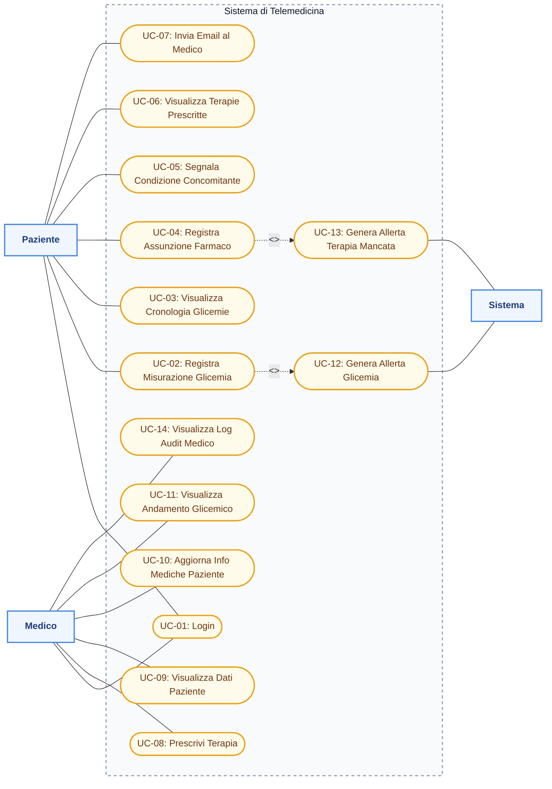

---

## 3. Schede di Specifica dei Casi d'Uso

### UC-01: Login

| Campo                  | Descrizione                                                                                                                                                                                                       |
| ---------------------- | ----------------------------------------------------------------------------------------------------------------------------------------------------------------------------------------------------------------- |
| **ID**                 | UC-01                                                                                                                                                                                                             |
| **Nome**               | Login (Accesso)                                                                                                                                                                                                   |
| **Attore/i**           | Paziente, Medico                                                                                                                                                                                                  |
| **Precondizione**      | L'utente possiede credenziali valide registrate nel sistema.                                                                                                                                                      |
| **Flusso Principale**  | 1. L'utente accede alla schermata di login. 2. L'utente inserisce username e password. 3. Il sistema verifica le credenziali nel database. 4. Il sistema reindirizza alla dashboard corretta (paziente o medico). |
| **Flusso Alternativo** | 3a. Le credenziali non sono valide → Il sistema mostra un messaggio di errore e rimane sulla schermata di login.                                                                                                  |
| **Postcondizione**     | L'utente è autenticato e ha accesso alla propria dashboard specifica.                                                                                                                                             |

### UC-02: Registra Misurazione Glicemia

| Campo                  | Descrizione                                                                                                                                                                                                                                                                                                                                                                               |
| ---------------------- | ----------------------------------------------------------------------------------------------------------------------------------------------------------------------------------------------------------------------------------------------------------------------------------------------------------------------------------------------------------------------------------------- |
| **ID**                 | UC-02                                                                                                                                                                                                                                                                                                                                                                                     |
| **Nome**               | Registra Misurazione Glicemia                                                                                                                                                                                                                                                                                                                                                             |
| **Attore/i**           | Paziente                                                                                                                                                                                                                                                                                                                                                                                  |
| **Precondizione**      | Il paziente è autenticato e si trova nella schermata di inserimento glicemia.                                                                                                                                                                                                                                                                                                             |
| **Flusso Principale**  | 1. Il paziente inserisce il valore di glicemia (mg/dL). 2. Il paziente seleziona la fascia oraria (prima/dopo pasto). 3. Il paziente seleziona data e ora. 4. Il paziente fa clic su "Salva". 5. Il sistema valida l'input. 6. Il sistema salva la misurazione nel database. 7. Il sistema verifica le soglie glicemiche tramite `MedicalRulesEngine`. 8. Il sistema mostra una conferma. |
| **Flusso Alternativo** | 5a. L'input non è valido → Viene mostrato un messaggio di errore. 7a. Il valore supera la soglia → Viene mostrato un avviso al paziente e inviata un'allerta al medico.                                                                                                                                                                                                                   |
| **Postcondizione**     | La misurazione è salvata. Se anomala, viene generata un'allerta.                                                                                                                                                                                                                                                                                                                          |

### UC-03: Visualizza Cronologia Glicemie

| Campo                 | Descrizione                                                                                                                                                                                                                                        |
| --------------------- | -------------------------------------------------------------------------------------------------------------------------------------------------------------------------------------------------------------------------------------------------- |
| **ID**                | UC-03                                                                                                                                                                                                                                              |
| **Nome**              | Visualizza Cronologia Glicemie                                                                                                                                                                                                                     |
| **Attore/i**          | Paziente                                                                                                                                                                                                                                           |
| **Precondizione**     | Il paziente è autenticato.                                                                                                                                                                                                                         |
| **Flusso Principale** | 1. Il paziente naviga alla cronologia della glicemia. 2. Il sistema carica tutte le misurazioni. 3. Il paziente filtra facoltativamente per intervallo di date. 4. Il sistema mostra le misurazioni in una tabella con lo stato (Normale/Anomalo). |
| **Postcondizione**    | Il paziente visualizza le letture glicemiche passate con indicatori visivi di stato.                                                                                                                                                               |

### UC-04: Registra Assunzione Farmaco

| Campo                  | Descrizione                                                                                                                                                                                                                                                                                               |
| ---------------------- | --------------------------------------------------------------------------------------------------------------------------------------------------------------------------------------------------------------------------------------------------------------------------------------------------------- |
| **ID**                 | UC-04                                                                                                                                                                                                                                                                                                     |
| **Nome**               | Registra Assunzione Farmaco                                                                                                                                                                                                                                                                               |
| **Attore/i**           | Paziente                                                                                                                                                                                                                                                                                                  |
| **Precondizione**      | Il paziente è autenticato e ha almeno una terapia attiva prescritta.                                                                                                                                                                                                                                      |
| **Flusso Principale**  | 1. Il paziente seleziona una terapia attiva dal menu a discesa. 2. Il sistema autocompila il nome del farmaco e la quantità suggerita. 3. Il paziente conferma/modifica quantità, data e ora. 4. Il paziente fa clic su "Salva". 5. Il sistema salva l'assunzione nel database collegandola alla terapia. |
| **Flusso Alternativo** | 1a. Nessuna terapia attiva → Messaggio che notifica la mancanza di terapie prescritte.                                                                                                                                                                                                                    |
| **Postcondizione**     | L'assunzione del farmaco viene registrata e collegata alla terapia prescritta per il tracciamento dell'aderenza.                                                                                                                                                                                          |

### UC-05: Segnala Condizione Concomitante

| Campo                 | Descrizione                                                                                                                                                                                                                                                                           |
| --------------------- | ------------------------------------------------------------------------------------------------------------------------------------------------------------------------------------------------------------------------------------------------------------------------------------- |
| **ID**                | UC-05                                                                                                                                                                                                                                                                                 |
| **Nome**              | Segnala Condizione Concomitante                                                                                                                                                                                                                                                       |
| **Attore/i**          | Paziente                                                                                                                                                                                                                                                                              |
| **Precondizione**     | Il paziente è autenticato.                                                                                                                                                                                                                                                            |
| **Flusso Principale** | 1. Il paziente seleziona il tipo di condizione (Sintomo, Patologia, Terapia Concomitante). 2. Il paziente inserisce la descrizione. 3. Il paziente seleziona la data di inizio (e la data di fine facoltativa). 4. Il paziente fa clic su "Salva". 5. Il sistema salva la condizione. |
| **Postcondizione**    | La condizione viene salvata ed è visibile al medico di riferimento del paziente.                                                                                                                                                                                                      |

### UC-06: Visualizza Terapie Prescritte

| Campo                 | Descrizione                                                                                                                                                                                           |
| --------------------- | ----------------------------------------------------------------------------------------------------------------------------------------------------------------------------------------------------- |
| **ID**                | UC-06                                                                                                                                                                                                 |
| **Nome**              | Visualizza Terapie Prescritte                                                                                                                                                                         |
| **Attore/i**          | Paziente                                                                                                                                                                                              |
| **Precondizione**     | Il paziente è autenticato.                                                                                                                                                                            |
| **Flusso Principale** | 1. Il paziente naviga alla vista delle terapie. 2. Il sistema carica tutte le terapie (attive e interrotte). 3. Il sistema le mostra in una tabella con farmaco, dosaggio, indicazioni, date e stato. |
| **Postcondizione**    | Il paziente visualizza tutte le terapie attuali e passate.                                                                                                                                            |

### UC-08: Prescrivi Terapia

| Campo                  | Descrizione                                                                                                                                                                                                                                                                                                                                                                    |
| ---------------------- | ------------------------------------------------------------------------------------------------------------------------------------------------------------------------------------------------------------------------------------------------------------------------------------------------------------------------------------------------------------------------------ |
| **ID**                 | UC-08                                                                                                                                                                                                                                                                                                                                                                          |
| **Nome**               | Prescrivi Terapia                                                                                                                                                                                                                                                                                                                                                              |
| **Attore/i**           | Medico                                                                                                                                                                                                                                                                                                                                                                         |
| **Precondizione**      | Il medico è autenticato.                                                                                                                                                                                                                                                                                                                                                       |
| **Flusso Principale**  | 1. Il medico seleziona un paziente dalla dashboard. 2. Il medico fa clic su "Terapia" per aprire il form di prescrizione. 3. Il medico inserisce nome farmaco, assunzioni giornaliere, quantità, indicazioni e data inizio. 4. Il medico fa clic su "Salva Terapia". 5. Il sistema salva la terapia nel database. 6. Il sistema crea una voce di audit log in `operation_log`. |
| **Flusso Alternativo** | 4a. Campi obbligatori mancanti → Errore visualizzato.                                                                                                                                                                                                                                                                                                                          |
| **Postcondizione**     | La nuova terapia è attiva e visibile al paziente. L'operazione viene registrata.                                                                                                                                                                                                                                                                                               |

### UC-09: Visualizza Dati Paziente

| Campo                 | Descrizione                                                                                                                                                                                                                                                                                          |
| --------------------- | ---------------------------------------------------------------------------------------------------------------------------------------------------------------------------------------------------------------------------------------------------------------------------------------------------- |
| **ID**                | UC-09                                                                                                                                                                                                                                                                                                |
| **Nome**              | Visualizza Dati Paziente                                                                                                                                                                                                                                                                             |
| **Attore/i**          | Medico                                                                                                                                                                                                                                                                                               |
| **Precondizione**     | Il medico è autenticato.                                                                                                                                                                                                                                                                             |
| **Flusso Principale** | 1. Il medico visualizza la lista dei pazienti sulla dashboard. 2. Il medico fa clic su "Visualizza" su un paziente. 3. Il sistema carica le informazioni del paziente, le misurazioni glicemiche, le terapie e le condizioni concomitanti. 4. Il sistema mostra tutti i dati organizzati in sezioni. |
| **Postcondizione**    | Il medico ha una visibilità completa sui dati clinici del paziente.                                                                                                                                                                                                                                  |

### UC-10: Aggiorna Info Mediche Paziente

| Campo                 | Descrizione                                                                                                                                                                                                                                                                           |
| --------------------- | ------------------------------------------------------------------------------------------------------------------------------------------------------------------------------------------------------------------------------------------------------------------------------------- |
| **ID**                | UC-10                                                                                                                                                                                                                                                                                 |
| **Nome**              | Aggiorna Info Mediche Paziente                                                                                                                                                                                                                                                        |
| **Attore/i**          | Medico                                                                                                                                                                                                                                                                                |
| **Precondizione**     | Il medico è autenticato.                                                                                                                                                                                                                                                              |
| **Flusso Principale** | 1. Il medico fa clic su "Info" su un paziente. 2. Il sistema carica i fattori di rischio, le patologie pregresse e le comorbilità attuali. 3. Il medico modifica i campi. 4. Il medico fa clic su "Salva Modifiche". 5. Il sistema aggiorna il database e crea una voce di audit log. |
| **Postcondizione**    | Le informazioni mediche del paziente sono aggiornate. L'operazione è tracciata con l'identità del medico in `operation_log`.                                                                                                                                                          |

### UC-11: Visualizza Andamento Glicemico

| Campo                 | Descrizione                                                                                                                                                                                                                                                                                               |
| --------------------- | --------------------------------------------------------------------------------------------------------------------------------------------------------------------------------------------------------------------------------------------------------------------------------------------------------- |
| **ID**                | UC-11                                                                                                                                                                                                                                                                                                     |
| **Nome**              | Visualizza Andamento Glicemico (Riepilogo Sintetico)                                                                                                                                                                                                                                                      |
| **Attore/i**          | Medico                                                                                                                                                                                                                                                                                                    |
| **Precondizione**     | Il medico è autenticato e visualizza il dettaglio di un paziente.                                                                                                                                                                                                                                         |
| **Flusso Principale** | 1. Il medico fa clic su "Grafico Glicemia". 2. Il medico seleziona il periodo (settimanale o mensile). 3. Il sistema calcola i valori medi di glicemia (prima/dopo pasto), le misurazioni totali e il conteggio dei valori anomali per ciascun periodo. 4. Il sistema mostra il riepilogo in una tabella. |
| **Postcondizione**    | Il medico visualizza l'evoluzione glicemica nel tempo in formato sintetico.                                                                                                                                                                                                                               |

### UC-14: Visualizza Log Audit Medico

| Campo                 | Descrizione                                                                                                                                                                                                                                                                                                                                 |
| --------------------- | ------------------------------------------------------------------------------------------------------------------------------------------------------------------------------------------------------------------------------------------------------------------------------------------------------------------------------------------- |
| **ID**                | UC-14                                                                                                                                                                                                                                                                                                                                       |
| **Nome**              | Visualizza Log Audit Medico                                                                                                                                                                                                                                                                                                                 |
| **Attore/i**          | Medico                                                                                                                                                                                                                                                                                                                                      |
| **Precondizione**     | Il medico è autenticato.                                                                                                                                                                                                                                                                                                                    |
| **Flusso Principale** | 1. Il medico fa clic su "Visualizza Log Audit" sulla dashboard. 2. Il sistema recupera tutti i log da `operation_log` in cui `doctor_id` corrisponde al medico corrente. 3. Il sistema mappa gli ID dei pazienti di destinazione ai rispettivi nomi completi. 4. Il sistema mostra i log in una tabella ordinata per timestamp decrescente. |
| **Postcondizione**    | Il medico visualizza un elenco modale delle proprie azioni mediche sul database.                                                                                                                                                                                                                                                            |

---

## 4. Diagramma delle Classi Concettuali

Il diagramma delle classi concettuali modella le entità del dominio applicativo e le loro associazioni, indipendentemente dalla tecnologia di persistenza.

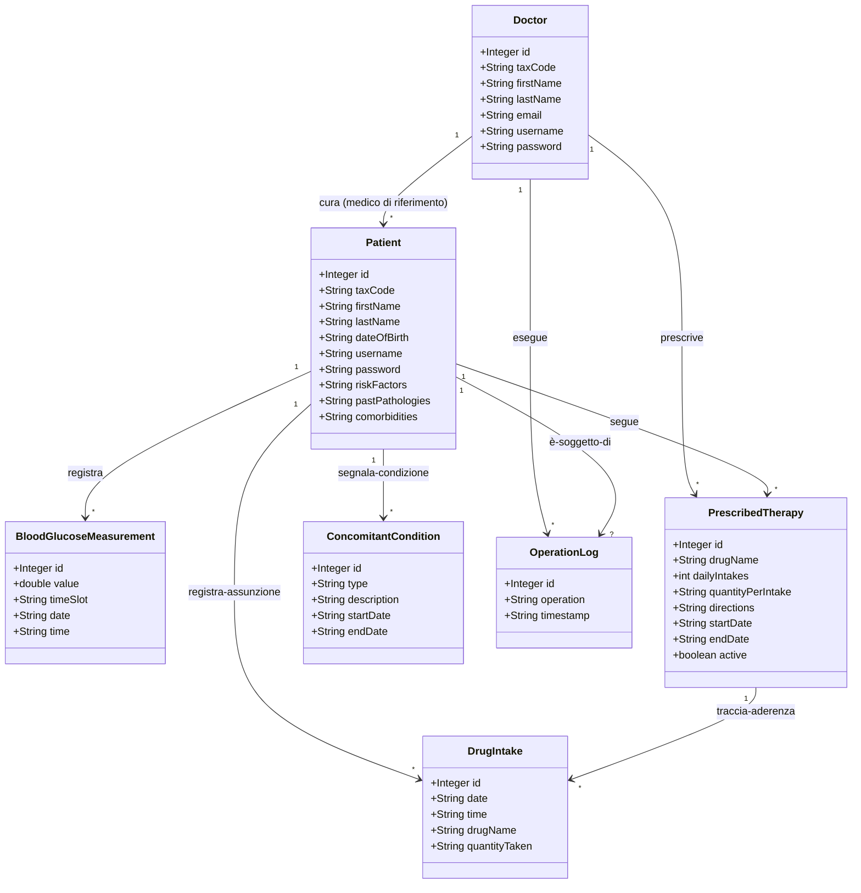

### Descrizione delle Classi Concettuali

- **Doctor (Medico)**: Rappresenta il diabetologo autenticato che monitora i pazienti, configura le terapie e aggiorna le storie mediche.
- **Patient (Paziente)**: Rappresenta il paziente diabetico monitorato che registra le letture glicemiche giornaliere e le assunzioni di farmaci.
- **BloodGlucoseMeasurement (Misurazione Glicemia)**: Rappresenta una singola lettura del livello di glucosio nel sangue registrata da un paziente.
- **PrescribedTherapy (Terapia Prescritta)**: Rappresenta lo schema di prescrizione di un farmaco emesso da un medico per uno specifico paziente.
- **DrugIntake (Assunzione Farmaco)**: Rappresenta il registro auto-segnalato da un paziente che indica l'avvenuta assunzione di una dose di farmaco prescritto.
- **ConcomitantCondition (Condizione Concomitante)**: Rappresenta sintomi, altre patologie concomitanti o terapie non prescritte seguite dal paziente.
- **OperationLog (Log Operazione)**: Log di audit che cattura le azioni sensibili eseguite dai medici sulle cartelle dei pazienti (es. modifica terapie, aggiornamento fattori di rischio).

---

## 5. Diagrammi di Attività

### 5.1 Diagramma di Attività: Login e Autenticazione

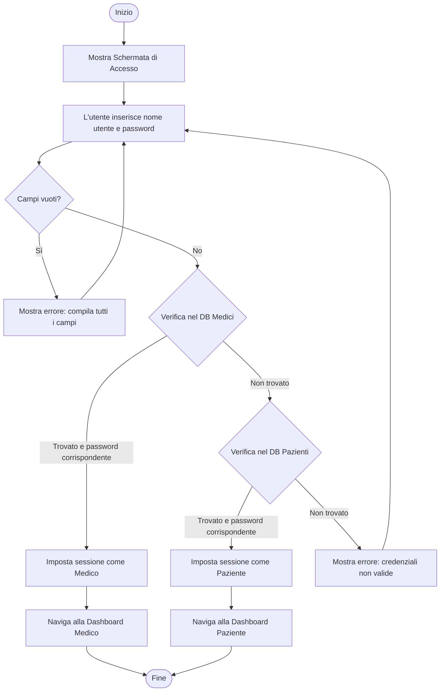

### 5.2 Diagramma di Attività: Registra Misurazione Glicemia

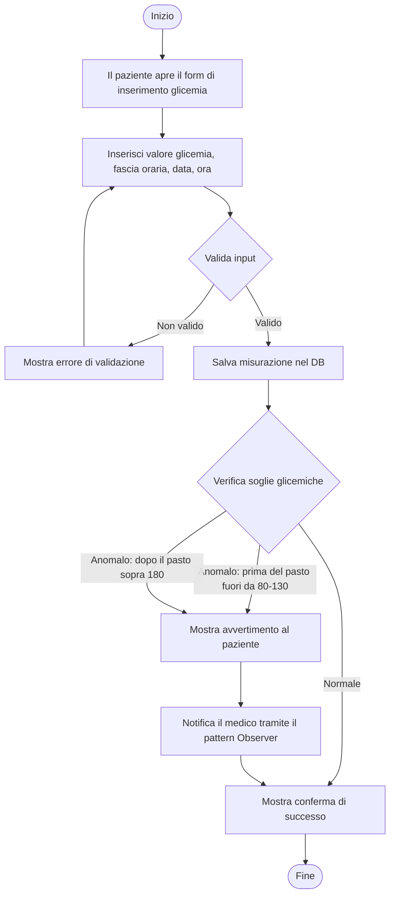

### 5.3 Diagramma di Attività: Registra Assunzione Farmaco

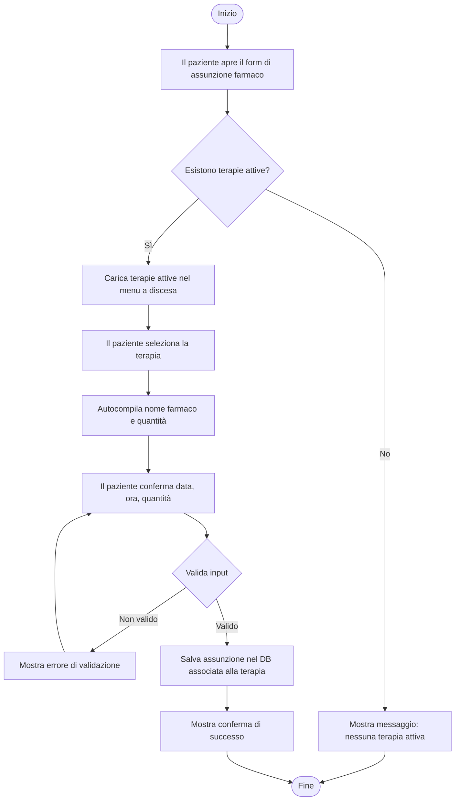

### 5.4 Diagramma di Attività: Prescrivi Terapia

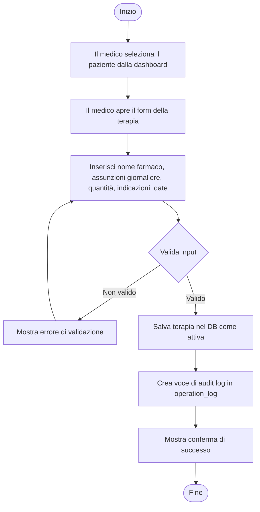

### 5.5 Diagramma di Attività: Generazione Allerta Terapia Mancata

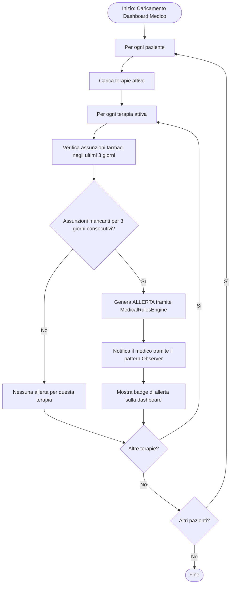

---

## 6. Architettura e Design Pattern

### Architettura a Livelli (Layered)

L'applicazione adotta un'**Architettura a Livelli (Layered Architecture)** separando nettamente Presentazione, Logica di Business e Persistenza:

- **Livello di Presentazione (JavaFX)**: Gestisce solo le viste FXML e i relativi controller. Delega le decisioni logiche al livello di business e la formattazione agli oggetti di dominio.
- **Livello Logica di Business (`it.univr.telemedicina.logic`)**: Centralizza le regole mediche (`MedicalRulesEngine`). Non contiene codice dell'interfaccia grafica (GUI) né query SQL.
- **Livello di Persistenza (`it.univr.telemedicina.persistence`)**: Gestisce le connessioni SQLite ed esegue le operazioni CRUD tramite DAO.

### Design Pattern utilizzati

1.  **Observer Pattern**: Utilizzato per disaccoppiare il componente che verifica le regole mediche (`MedicalRulesEngine`, inteso come _Subject_) dai componenti che devono reagire alle anomalie (es. la dashboard del medico che mostra le notifiche, intesa come _Observer_). Ciò garantisce che l'aggiunta di un nuovo meccanismo di notifica non richieda modifiche alla logica principale.
2.  **Data Access Object (DAO) Pattern**: Incapsula tutto l'accesso al database SQLite. Il livello logico dipende da oggetti di dominio (come `Patient`) e interagisce con i DAO, ignorando i dettagli del dialetto SQL sottostante.

---

## 7. Diagramma delle Classi Software (Logica di Business)

Il seguente diagramma delle classi rappresenta il design del livello di Dominio e Logica dell'applicazione, incorporando l'Observer Pattern per le allerte mediche.

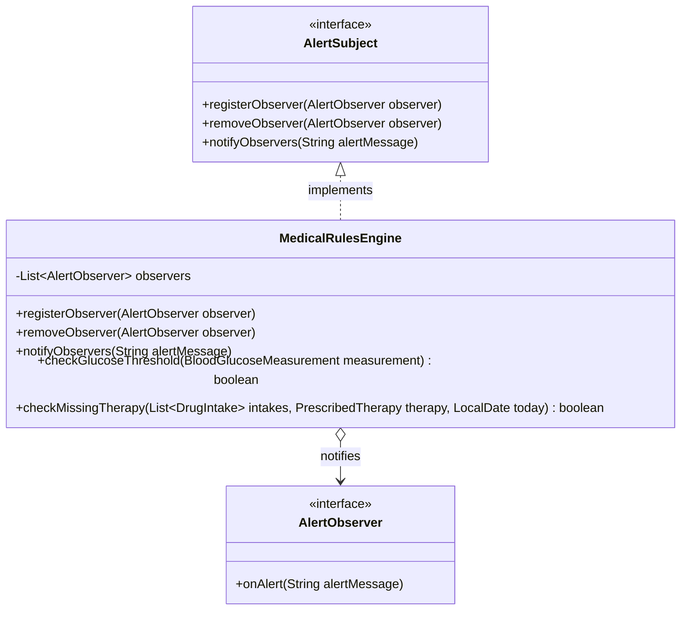

---

## 8. Diagrammi di Sequenza

I seguenti diagrammi di sequenza illustrano i flussi di interazione dettagliati per i casi d'uso principali del sistema di telemedicina.

### 8.1 UC-02: Registra Misurazione Glicemia

Questo diagramma mostra il flusso quando un paziente registra una nuova lettura della glicemia. Il livello di presentazione salva la misurazione nel database e la valuta tramite il motore delle regole, che notifica gli osservatori attivi se il valore è anomalo.

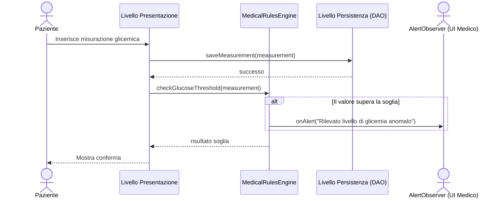

### 8.2 UC-01: Login e Reindirizzamento Sessione

Questo diagramma mostra il flusso di autenticazione quando un utente effettua l'accesso. Il sistema interroga le tabelle del database corrispondenti in base alle credenziali per verificare l'identità e reindirizzare alla dashboard corretta.

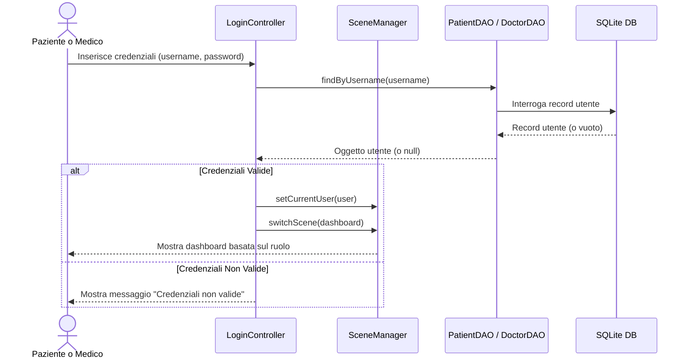

### 8.3 UC-08: Prescrivi Terapia

Questo diagramma mostra il flusso quando un medico prescrive una terapia. La terapia è salvata come attiva e l'azione è registrata nella tabella di audit log nel database.

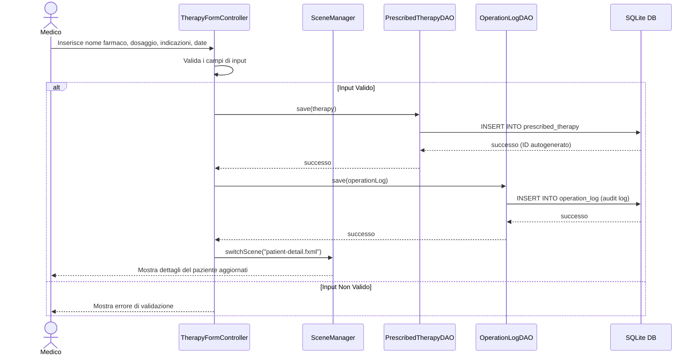

### 8.4 UC-04: Registra Assunzione Farmaco

Questo diagramma mostra il flusso quando un paziente segnala un'assunzione di farmaco associata a una terapia prescritta.

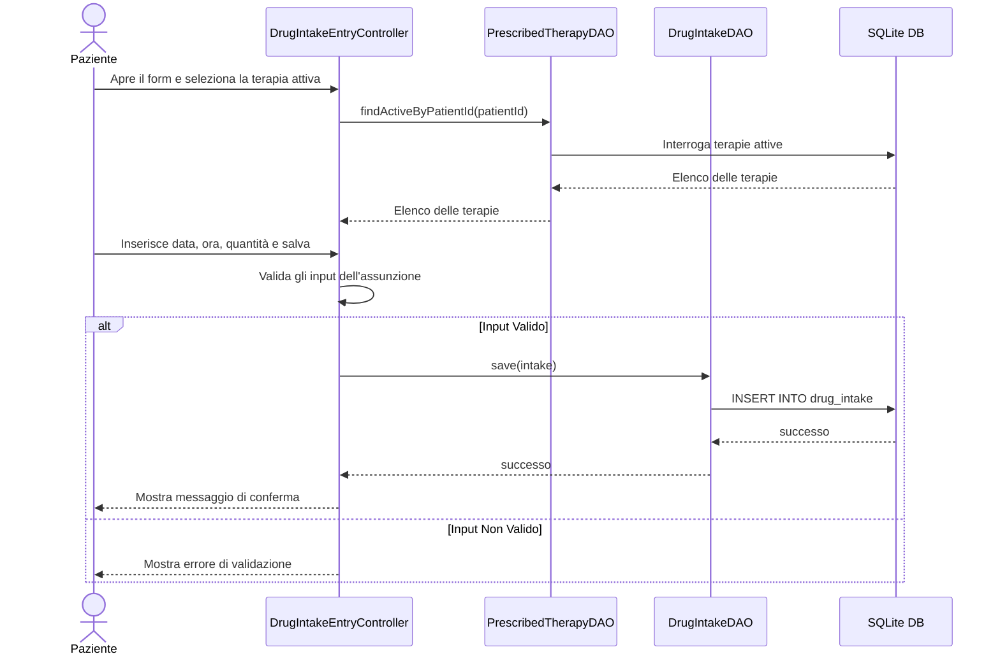

---

## 9. Schema Entità-Relazione (ER)

Lo schema ER definisce la struttura logica del database relazionale implementato all'interno del database SQLite.

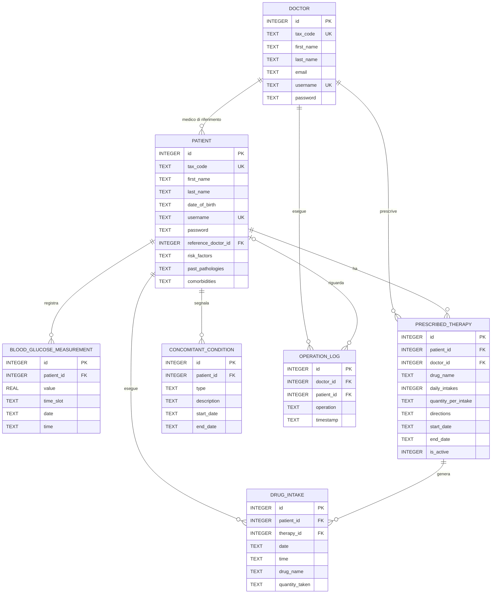

### Regole Relazionali e Vincoli di Integrità Referenziale

1.  **Medico - Paziente (1:N)**: A ogni paziente è assegnato un medico di riferimento. Se si tenta di eliminare un medico a cui sono attualmente assegnati pazienti, l'azione viene bloccata (`ON DELETE RESTRICT`) per evitare di lasciare pazienti orfani.
2.  **Paziente - Misurazione Glicemia (1:N)**: Le misurazioni appartengono a uno specifico paziente. Se il record del paziente viene eliminato, tutte le misurazioni associate vengono eliminate in modo ricorsivo (`ON DELETE CASCADE`).
3.  **Paziente - Terapia Prescritta (1:N)** e **Medico - Terapia Prescritta (1:N)**: Una terapia appartiene a un paziente ed è collegata al medico che l'ha prescritta. L'eliminazione del paziente rimuove le terapie (`ON DELETE CASCADE`). L'eliminazione del medico è bloccata (`ON DELETE RESTRICT`) per preservare lo storico delle prescrizioni.
4.  **Terapia Prescritta - Assunzione Farmaco (1:N)**: Ogni assunzione inserita fa riferimento a una prescrizione attiva. Se una terapia viene eliminata, i dati di aderenza associati vengono eliminati a cascata (`ON DELETE CASCADE`).

---

## 10. Descrizione Dettagliata delle Tabelle del Database

Tutti i tipi di dati sono mappati sulle classi di memorizzazione native di SQLite (`INTEGER`, `REAL`, `TEXT`). Le date e le ore sono memorizzate come `TEXT` nel formato standard ISO-8601 per consentire ordinamenti e controlli di intervallo corretti.

### Tabella: `doctor`

Memorizza le credenziali e le informazioni demografiche dei medici diabetologi.

- **id**: `INTEGER` (PRIMARY KEY, AUTOINCREMENT). Identificativo unico del medico.
- **tax_code**: `TEXT` (UNIQUE, NOT NULL). Codice Fiscale del medico.
- **first_name**: `TEXT` (NOT NULL). Nome.
- **last_name**: `TEXT` (NOT NULL). Cognome.
- **email**: `TEXT` (UNIQUE, NOT NULL). Indirizzo email del medico.
- **username**: `TEXT` (UNIQUE, NOT NULL). Nome utente per il login.
- **password**: `TEXT` (NOT NULL). Password di login.

### Tabella: `patient`

Memorizza i profili dei pazienti, i dati demografici e i blocchi di testo della storia clinica.

- **id**: `INTEGER` (PRIMARY KEY, AUTOINCREMENT). Identificativo unico del paziente.
- **tax_code**: `TEXT` (UNIQUE, NOT NULL). Codice Fiscale del paziente.
- **first_name**: `TEXT` (NOT NULL). Nome.
- **last_name**: `TEXT` (NOT NULL). Cognome.
- **date_of_birth**: `TEXT` (NOT NULL). Data di nascita nel formato `YYYY-MM-DD`.
- **username**: `TEXT` (UNIQUE, NOT NULL). Nome utente per il login del paziente.
- **password**: `TEXT` (NOT NULL). Password di login.
- **reference_doctor_id**: `INTEGER` (NOT NULL, FOREIGN KEY). Collegamento al medico responsabile.
- **risk_factors**: `TEXT` (NULL). Note sui fattori di rischio (es. "fumatore, obesità").
- **past_pathologies**: `TEXT` (NULL). Dettagli sulle patologie pregresse.
- **comorbidities**: `TEXT` (NULL). Patologie concomitanti attive (es. "ipertensione").

### Tabella: `blood_glucose_measurement`

Memorizza i log glicemici dei pazienti.

- **id**: `INTEGER` (PRIMARY KEY, AUTOINCREMENT). Identificativo del log.
- **patient_id**: `INTEGER` (NOT NULL, FOREIGN KEY). Riferimento al paziente.
- **value**: `REAL` (NOT NULL). Valore di glicemia misurato (in mg/dL).
- **time_slot**: `TEXT` (NOT NULL). Categoria della misurazione (deve essere `'BEFORE_MEAL'` o `'AFTER_MEAL'`).
- **date**: `TEXT` (NOT NULL). Data nel formato `YYYY-MM-DD`.
- **time**: `TEXT` (NOT NULL). Ora nel formato `HH:MM`.

### Tabella: `prescribed_therapy`

Contiene le prescrizioni farmacologiche attive e storiche.

- **id**: `INTEGER` (PRIMARY KEY, AUTOINCREMENT). Identificativo della prescrizione.
- **patient_id**: `INTEGER` (NOT NULL, FOREIGN KEY). Riferimento al paziente.
- **doctor_id**: `INTEGER` (NOT NULL, FOREIGN KEY). Riferimento al medico che ha prescritto la terapia.
- **drug_name**: `TEXT` (NOT NULL). Nome del farmaco (es. "Metformina", "Insulina Rapida").
- **daily_intakes**: `INTEGER` (NOT NULL). Frequenza di assunzione giornaliera.
- **quantity_per_intake**: `TEXT` (NOT NULL). Quantità per assunzione (es. "500mg", "1 pillola").
- **directions**: `TEXT` (NULL). Indicazioni d'uso (es. "dopo i pasti", "a stomaco vuoto").
- **start_date**: `TEXT` (NOT NULL). Data di inizio validità (`YYYY-MM-DD`).
- **end_date**: `TEXT` (NULL). Data di fine validità (`YYYY-MM-DD`). NULL se in corso.
- **is_active**: `INTEGER` (NOT NULL, DEFAULT 1). Flag booleano (1 = Attiva, 0 = Interrotta/Sostituita).

### Tabella: `drug_intake`

Traccia i registri di assunzione effettivi inseriti dai pazienti.

- **id**: `INTEGER` (PRIMARY KEY, AUTOINCREMENT). Identificativo del registro.
- **patient_id**: `INTEGER` (NOT NULL, FOREIGN KEY). Riferimento al paziente.
- **therapy_id**: `INTEGER` (NOT NULL, FOREIGN KEY). Riferimento alla prescrizione associata.
- **date**: `TEXT` (NOT NULL). Data del registro (`YYYY-MM-DD`).
- **time**: `TEXT` (NOT NULL). Ora del registro (`HH:MM`).
- **drug_name**: `TEXT` (NOT NULL). Nome del farmaco registrato.
- **quantity_taken**: `TEXT` (NOT NULL). Quantità assunta.

### Tabella: `concomitant_condition`

Traccia sintomi, malattie temporanee o terapie concomitanti auto-segnalate dai pazienti.

- **id**: `INTEGER` (PRIMARY KEY, AUTOINCREMENT). Identificativo della condizione.
- **patient_id**: `INTEGER` (NOT NULL, FOREIGN KEY). Riferimento al paziente.
- **type**: `TEXT` (NOT NULL). Categoria della condizione (`'SYMPTOM'`, `'PATHOLOGY'`, o `'CONCOMITANT_THERAPY'`).
- **description**: `TEXT` (NOT NULL). Descrizione libera (es. "nausea", "mal di testa").
- **start_date**: `TEXT` (NOT NULL). Data di inizio del periodo (`YYYY-MM-DD`).
- **end_date**: `TEXT` (NULL). Data di fine del periodo (`YYYY-MM-DD`). NULL se in corso.

### Tabella: `operation_log`

Traccia di audit delle azioni dei medici per la sicurezza e la conformità del sistema.

- **id**: `INTEGER` (PRIMARY KEY, AUTOINCREMENT). Identificativo del log.
- **doctor_id**: `INTEGER` (NOT NULL, FOREIGN KEY). Riferimento al medico che ha eseguito l'azione.
- **patient_id**: `INTEGER` (NULL, FOREIGN KEY). Paziente target o NULL se generale. Impostato a NULL all'eliminazione del paziente (`ON DELETE SET NULL`).
- **operation**: `TEXT` (NOT NULL). Descrizione dell'azione (es. "Modifica terapia: Metformina", "Aggiornamento comorbilità").
- **timestamp**: `TEXT` (NOT NULL). Data e ora dell'azione (`YYYY-MM-DD HH:MM:SS`).

---

## 11. Descrizione Dettagliata delle Attività di Test

Questa sezione fornisce una descrizione dettagliata delle attività di verifica svolte per garantire la correttezza, robustezza e conformità del sistema di telemedicina. La strategia di test sfrutta JUnit 5 ed è strutturata su tre livelli: Test Unitari, Test di Consistenza dei Dati e Test di Sistema.

### 11.1 Test Unitari (White-Box)

I test unitari verificano le singole regole della logica di business e i singoli metodi in isolamento. Sono implementati in `MedicalRulesEngineTest.java` e si concentrano sulla verifica del motore delle regole mediche.

- **Casi di Test per le Soglie Glicemiche:**
  - `testCheckGlucoseThreshold_NormalBeforeMeal`: Verifica che un valore glicemico di 100.0 mg/dL prima dei pasti sia considerato normale (restituisce `false` e non attiva notifiche o allerte).
  - `testCheckGlucoseThreshold_HighBeforeMeal`: Verifica che un valore glicemico di 140.0 mg/dL prima dei pasti sia rilevato come anomalo (restituisce `true` e notifica gli osservatori).
  - `testCheckGlucoseThreshold_NormalAfterMeal`: Verifica che un valore glicemico di 150.0 mg/dL dopo i pasti sia considerato normale (restituisce `false` e non attiva allerte).
  - `testCheckGlucoseThreshold_HighAfterMeal`: Verifica che un valore glicemico di 190.0 mg/dL dopo i pasti sia rilevato come anomalo (restituisce `true` e notifica gli osservatori).
- **Casi di Test per l'Aderenza alla Terapia (Allerte):**
  - `testCheckMissingTherapy_NotMissing`: Verifica che se un paziente registra assunzioni corrispondenti alla frequenza prescritta per gli ultimi 3 giorni consecutivi, il motore delle regole non generi alcuna allerta.
  - `testCheckMissingTherapy_MissingThreeDays`: Verifica che se non viene registrata alcuna assunzione per gli ultimi 3 giorni per una terapia attiva, il motore restituisca `true` e generi un'allerta medica per notificare il medico.

### 11.2 Test di Consistenza dei Dati (Vincoli del Database)

I test di consistenza dei dati sono progettati per convalidare i vincoli del database, le regole relazionali, l'integrità referenziale e la correttezza delle transazioni nel database SQLite. Sono implementati in `DataConsistencyTest.java`.

- **Integrità Relazionale e Vincoli di Unicità:**
  - `testCreateAndRetrieveDoctorAndPatient`: Inserisce record di medici e pazienti e verifica che le chiavi primarie generate vengano create e gli attributi siano recuperati correttamente.
  - `testUniqueConstraints`: Verifica che il salvataggio di due medici con lo stesso username o lo stesso Codice Fiscale fallisca sollevando un'eccezione SQL (`SQLException`).
  - `testForeignKeyDoctorDoesNotExist`: Convalida l'integrità referenziale verificando che il salvataggio di un paziente con un ID medico non esistente lanci una violazione del vincolo di chiave esterna.
- **Vincoli di Eliminazione e Cascade:**
  - `testDoctorDeletionRestricted`: Verifica che un medico a cui sono assegnati pazienti attivi non possa essere eliminato a causa del vincolo `ON DELETE RESTRICT`, garantendo che i pazienti non rimangano orfani.
  - `testCascadingDeletePatient`: Verifica che l'eliminazione di un paziente elimini in cascata tutte le entità associate (`BLOOD_GLUCOSE_MEASUREMENT`, `PRESCRIBED_THERAPY`, `DRUG_INTAKE` e `CONCOMITANT_CONDITION`) usando il vincolo `ON DELETE CASCADE` di SQLite.
  - `testLogOperazioneAndAudit`: Verifica che all'eliminazione di un paziente i log di audit ad esso associati nella tabella `operation_log` persistano, ma che il campo `patient_id` venga impostato a `NULL` (`ON DELETE SET NULL`), preservando i dettagli dell'azione svolta dal medico ma rimuovendo il riferimento al paziente rimosso.
- **Correttezza delle Query e Operazioni CRUD:**
  - `testBloodGlucoseDateFilters`: Verifica che le query basate su intervallo restituiscano solo le misurazioni della glicemia registrate tra le date di inizio e fine richieste.
  - `testConcomitantConditionOperations`: Verifica le operazioni CRUD di base (creazione, query per tipo, aggiornamento) per i sintomi e le patologie segnalate dall'utente.

### 11.3 Test di Sistema (Black-Box / E2E Integration)

I test di sistema simulano i flussi di integrazione end-to-end, assicurando che tutti i livelli (presentazione, logica, database) collaborino per soddisfare i requisiti. Sono implementati in `SystemTest.java`.

- **Autenticazione e Controllo degli Accessi:**
  - `testLoginPatient` e `testLoginDoctor`: Verificano che credenziali valide di pazienti e medici consentano l'accesso con successo.
  - `testLoginInvalidCredentials`: Verificano che i tentativi di accesso con username inesistenti o password errate falliscano in modo appropriato.
- **Flussi di Lavoro del Paziente:**
  - `testPatientEnterGlucose`: Simula l'inserimento di una misurazione della glicemia giornaliera da parte del paziente e verifica che sia memorizzata correttamente nel database.
  - `testPatientGlucoseAlertGenerated`: Simula l'inserimento di valori glicemici anomali e verifica che si attivino avvisi grafici a schermo e messaggi di allerta nel motore delle regole.
  - `testPatientRecordDrugIntake`: Simula la registrazione di un'assunzione di farmaco che corrisponde a una terapia attiva prescritta.
  - `testPatientReportSymptom`: Verifica che i sintomi segnalati e le condizioni concomitanti vengano salvati e classificati correttamente.
- **Flussi di Lavoro del Medico:**
  - `testDoctorPrescribeTherapy`: Simula la prescrizione di una nuova terapia da parte del medico e verifica che la stessa sia salvata come attiva e che l'operazione venga registrata nell'audit log (`operation_log`).
  - `testDoctorViewPatientData`: Simula la visualizzazione dei dettagli di un paziente da parte del medico, assicurando che la storia clinica, l'andamento glicemico e le terapie siano visibili.
  - `testDoctorUpdatePatientInfo`: Simula l'aggiornamento dei fattori di rischio, delle patologie pregresse e delle comorbilità da parte del medico, e verifica che le informazioni siano aggiornate e registrate nell'audit log.
- **Integrazione del Motore delle Allerte:**
  - `testMissingTherapyAlertFlow`: Simula la verifica dell'aderenza terapeutica per un paziente che non ha registrato assunzioni negli ultimi 3 giorni e asserisce che il motore delle regole mostri un badge di allerta sulla dashboard del medico di riferimento.
  - `testTherapyComplianceCheck`: Asserisce che un paziente adempiente che registra le assunzioni regolarmente non faccia scattare alcuna allerta.
